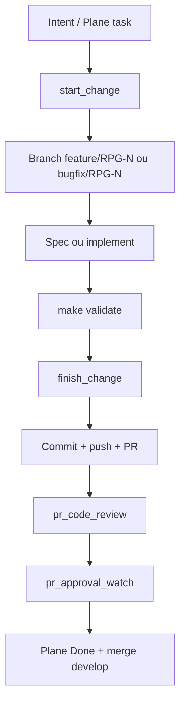

# Change lifecycle — toda alteração de código

Workflow **obrigatório** para qualquer mudança no repositório. Complementa [github-lifecycle.md](github-lifecycle.md) e [plane-lifecycle.md](plane-lifecycle.md).



## Regra de ouro

**Nenhuma alteração de código** em branch protegida (`main`, `develop`, `master`). Toda mudança começa com `start_change` e termina com `finish_change`.

## Fase 0 — Rastreabilidade (Plane + GitHub)

| Artefato | Onde | Quando |
|----------|------|--------|
| Work item | Plane | Antes de codar |
| Issue espelhada | GitHub `sdlc:intent` | Opcional; obrigatório para PRs grandes |
| Descrição rica | Plane (4 seções) | Skill `plane-task-creation` |

## Fase 1 — start_change

**Command:** `start_change` · **Script:** `.sdlc/scripts/gh-branch-start.sh`

1. Resolver identificador Plane (`RPG-123`) — skill [branch-naming](../skills/branch-naming/SKILL.md).
2. Classificar: `feature/` (novo) ou `bugfix/` (defeito/regressão).
3. Atualizar card Plane → **In Progress**.
4. Criar branch a partir de `develop`:

```bash
.sdlc/scripts/gh-branch-start.sh feature RPG-123
.sdlc/scripts/gh-branch-start.sh bugfix RPG-456
```

5. Confirmar padrão: `^(feature|bugfix)/[A-Za-z]+-\d+$`

## Fase 2 — Trabalho

Ordem recomendada:

1. **Spec** — se contrato, schema, canvas ou agente mudam → `specs/` ou `.sdlc/agents/`
2. **Compile** — `rpg compile --target all` quando aplicável
3. **Implement** — código em `apps/`, `services/`, `specs/`
4. **Validate** — `make validate` antes de commit

Hooks Cursor bloqueiam:

- Edição de `generated/`
- Commit em branch protegida
- Force-push em `main`/`master`

## Fase 3 — finish_change

**Command:** `finish_change`

1. `make validate` (ou `.sdlc/scripts/validate.sh`)
2. Commit com mensagem convencional (`feat:`, `fix:`, `spec:`, `chore:`)
3. Push da branch
4. Abrir PR com `.sdlc/scripts/gh-pr-open.sh` ou GitHub MCP
5. Comentar no Plane com link do PR
6. Delegar `pr_code_review` → `pr_approval_watch`

## Commits

| Tipo | Prefixo | Exemplo |
|------|---------|---------|
| Feature | `feat:` | `feat: add sheet validation endpoint` |
| Bugfix | `fix:` | `fix: correct DPA analyzer edge case` |
| Spec | `spec:` | `spec: extend TemplateAnalysisResult` |
| Chore | `chore:` | `chore: align branch naming docs` |

Um commit por unidade lógica. Ao fim de cada sessão de agente com alterações, **commit obrigatório** via `finish_change`.

## Integração lint / bugs

Falhas de lint ou CI → ver [lint-bug-resolution.md](lint-bug-resolution.md).

## Commands relacionados

| Command | Uso |
|---------|-----|
| `start_change` | Início: branch + Plane In Progress |
| `finish_change` | Fim: validate + commit + push + PR |
| `plane_card_execution` | Transições Plane com evidência |
| `issue_resolution` | Corrigir issue gerada por CI/lint |
| `issue_resolution_validation` | Validar fix até develop verde |

## Anti-patterns

- Codar direto em `develop` ou `main`
- Branch `feat/12-slug` ou nomes livres (legado — migrar para `feature/RPG-N`)
- PR sem card Plane ou sem validate local
- Fechar issue de lint sem evidência de checks verdes
