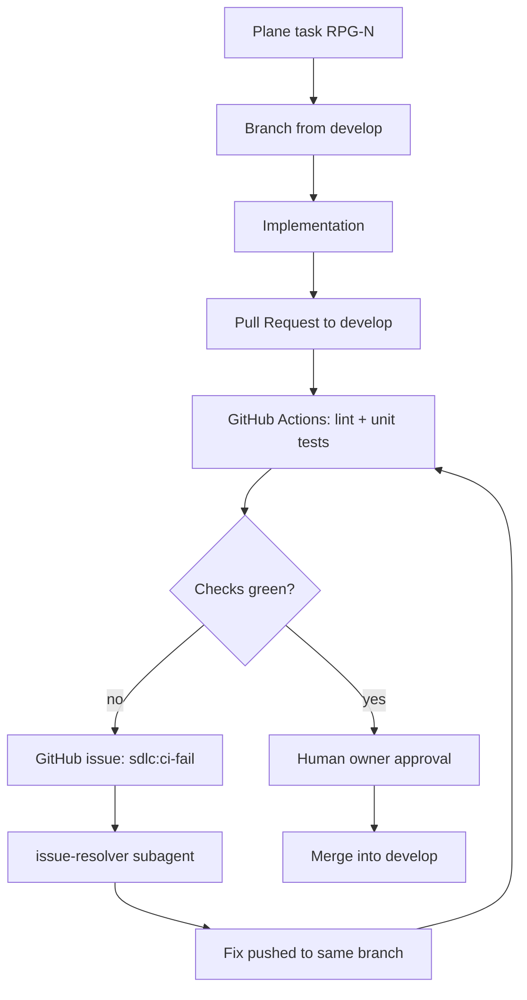

# GitHub lifecycle — SDLC completo

Ciclo de vida do RPG-OP conectado ao GitHub via **MCP** (agente no Cursor) + **gh CLI** (scripts) + **Actions** (CI).



## Fase 1 — Plane task

Antes de qualquer comando GitHub existir, crie ou recupere uma tarefa Plane.

Requisitos mínimos da tarefa:

- Identificador legível: `RPG-N`.
- Descrição com `context`, `changes`, `acceptance criteria`, `comments`.
- Comentário planejado: branch `feature/RPG-N` ou `bugfix/RPG-N`.

Sem tarefa Plane, o workflow GitHub deve parar.

## Fase 2 — Branch

Toda branch nasce de `develop` e segue um dos formatos:

```bash
.sdlc/scripts/gh-branch-start.sh feature RPG-123
.sdlc/scripts/gh-branch-start.sh bugfix RPG-456
```

Use `feature/` para trabalho planejado. Use `bugfix/` para defeitos, regressões, lint falho ou teste falho.

## Fase 3 — Implementação

Escopo atual do repositório:

- Produto: `apps/backend/` e `apps/frontend/`
- Operação SDLC: `.sdlc/`
- Cursor: `.cursor/`
- CI/GitHub: `.github/`
- Testes: `tests/`

Antes de commitar:

```bash
make test
make lint
make validate
```

## Fase 4 — Pull Request

```bash
.sdlc/scripts/gh-pr-open.sh "feat: template analyst spec" 12
```

Checklist do [PULL_REQUEST_TEMPLATE](../../.github/PULL_REQUEST_TEMPLATE.md).

O PR deve mirar `develop`.

**CI obrigatório:**

- `lint.yml`: ruff + frontend build/typecheck.
- `sdlc.yml`: unit tests (`pytest tests/ -q`) e import check do backend.

## Fase 5 — Falha de CI

Se lint ou testes falharem:

1. GitHub Action cria ou atualiza issue com label `sdlc:ci-fail` ou `sdlc:lint-fail`.
2. Workflow dispara o agente de correção (`lint-fix.yml` enquanto não houver runner AI dedicado).
3. `issue-resolver` lê issue, logs, branch, PR e Plane task.
4. Correção mínima é aplicada na mesma branch da PR.
5. Actions rodam novamente.
6. Issue só é fechada depois de checks verdes e evidência registrada.

Nunca enfraqueça lint, testes ou required checks para resolver a issue.

## Fase 6 — Review e merge

- Review humano é obrigatório.
- Merge permitido somente para `develop`.
- Merge só ocorre com checks verdes no head SHA mais recente.
- Plane card vai para `Done` apenas após merge em `develop`.

## Comandos úteis (gh)

| Ação | Comando |
|------|---------|
| Status repo | `gh repo view` |
| Listar issues SDLC | `gh issue list --label sdlc:ci-fail` |
| Ver PR checks | `gh pr checks` |
| Ver Actions | `gh run list --workflow=sdlc.yml` |
| Comentar issue | `gh issue comment 12 --body "Spec merged"` |

## Agente dev — quando usar MCP vs CLI

| Situação | Preferir |
|----------|----------|
| Explorar repo, issues, PRs no chat | **GitHub MCP** |
| Scripts repetíveis, CI, local gate | **gh CLI** + `.sdlc/scripts/` |
| Criar PR com body longo | MCP ou `gh pr create` |

## Referências

- [.sdlc/workflows/change-lifecycle.md](change-lifecycle.md)
- [.sdlc/integrations/github.md](../integrations/github.md)
- [.sdlc/skills/github-sdlc/SKILL.md](../skills/github-sdlc/SKILL.md)
- [.sdlc/commands/github.md](../commands/github.md)
