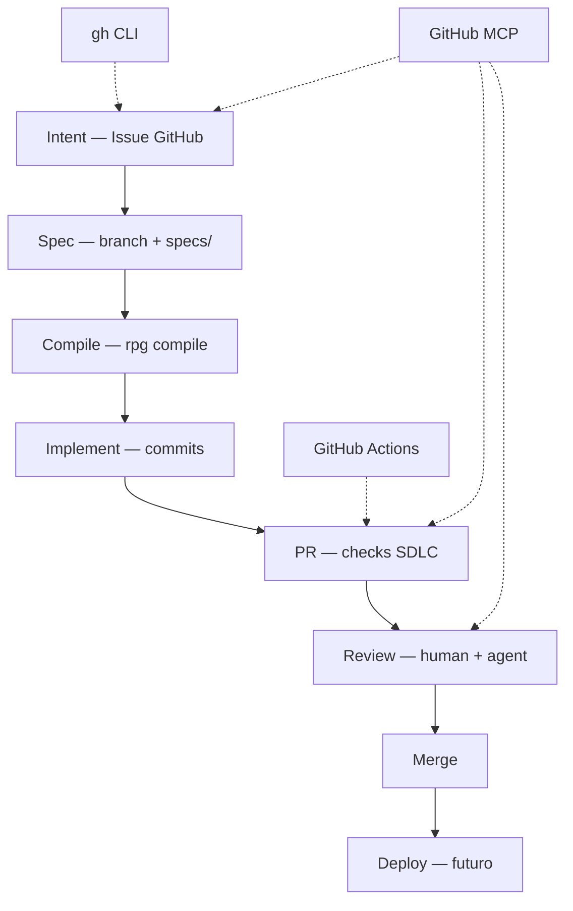

# GitHub lifecycle — SDLC completo

Ciclo de vida do RPG-OP conectado ao GitHub via **MCP** (agente no Cursor) + **gh CLI** (scripts) + **Actions** (CI).



## Fase 1 — Intent (Issue)

**Humano ou agente** cria issue a partir do template SDLC.

```bash
.sdlc/scripts/gh-issue-intent.sh "F2: sheet-template-analyst" .sdlc/templates/intent.md
```

**MCP:** pedir ao agente — "Crie issue no GitHub usando template SDLC para …"

Labels: `sdlc:intent`, `type:feature`

## Fase 2 — Spec (branch + DSL)

```bash
.sdlc/scripts/gh-branch-start.sh feature RPG-123
```

- Editar `specs/` ou `.sdlc/agents/`
- Label issue: `sdlc:spec`

**MCP:** listar issue, criar branch, comentar progresso na issue.

## Fase 3 — Compile

```bash
rpg validate specs/          # quando existir
rpg compile --target all
make validate
```

Commit sugerido: `spec: …` ou `chore(compile): …`

## Fase 4 — Implement

Hooks em `apps/`, `services/agent/`.

```bash
make validate
# finish_change: commit + push + PR
```

Label: `sdlc:implement` → `sdlc:ready`

## Fase 5 — Pull Request

```bash
.sdlc/scripts/gh-pr-open.sh "feat: template analyst spec" 12
```

Checklist do [PULL_REQUEST_TEMPLATE](../../.github/PULL_REQUEST_TEMPLATE.md).

**CI:** workflow `SDLC` — pytest + validate script.

**MCP:** criar PR, linkar issue (`Closes #12`), pedir review, ler check runs.

## Fase 6 — Review

- Agente usa MCP para ler comentários de review e checks falhos
- Humano aprova merge
- Squash merge → `main`

## Fase 7 — Deploy (backlog)

- `workflow_dispatch` ou push tag
- Smoke pós-deploy

## Comandos úteis (gh)

| Ação | Comando |
|------|---------|
| Status repo | `gh repo view` |
| Listar issues SDLC | `gh issue list --label sdlc:ready` |
| Ver PR checks | `gh pr checks` |
| Ver Actions | `gh run list --workflow=sdlc.yml` |
| Comentar issue | `gh issue comment 12 --body "Spec merged"` |

## Agente dev — quando usar MCP vs CLI

| Situação | Preferir |
|----------|----------|
| Explorar repo, issues, PRs no chat | **GitHub MCP** |
| Scripts repetíveis, CI, local gate | **gh CLI** + `.sdlc/scripts/` |
| Criar PR com body longo | MCP ou `gh pr create` |

## Referências

- [.sdlc/workflows/change-lifecycle.md](change-lifecycle.md)
- [.sdlc/integrations/github.md](../integrations/github.md)
- [.sdlc/skills/github-sdlc/SKILL.md](../skills/github-sdlc/SKILL.md)
- [.sdlc/commands/github.md](../commands/github.md)
