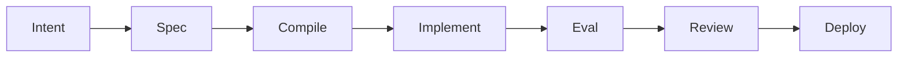

# Intent → Deploy

Fluxo padrão: ver **[github-lifecycle.md](github-lifecycle.md)** (GitHub Issues, PRs, MCP, Actions).

Fluxo genérico (sem GitHub):

## 1. Intent

- Copiar [.sdlc/templates/intent.md](../templates/intent.md)
- Descrever problema, escopo, fora de escopo

## 2. Spec

- Delegar **spec-author** se mudança toca contrato/agente/canvas
- Arquivos em `specs/` ou `.sdlc/agents/`

## 3. Compile

- Delegar **codegen-integrator**
- Rodar pipeline em [.sdlc/skills/compile-workflow/SKILL.md](../skills/compile-workflow/SKILL.md)

## 4. Implement

- Hooks: `backend/`, `apps/web/`, `services/agent/tools/`
- Sem lógica de negócio RPG em prompts

## 5. Eval

- Delegar **eval-engineer** para specs/evals/
- Gate: smoke pass (F2+)

## 6. Review / Deploy

- PR com diff em specs + generated (se policy commit generated)
- Smoke API pós-deploy

## Atalho MVP (sem rpg CLI)

Spec manual + implement direto + smoke_test — documentar dívida até L1.
