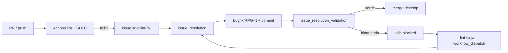

# Lint e resolução de bugs — loop GitHub integrado

Ciclo fechado entre **CI**, **issues GitHub**, **agente issue-resolver** e **Plane**.



## Labels SDLC

| Label | Significado | Próximo passo |
|-------|-------------|---------------|
| `sdlc:lint-fail` | Lint ou typecheck falhou | `issue_resolution` |
| `sdlc:blocked` | Auto-fix parcial ou dependência humana | Comentar + retomar |
| `sdlc:ready` | Implementação pronta para PR | `pr_code_review` |

## Detecção automática

1. **GitHub Actions** — workflows `lint.yml`, `sdlc.yml` falham no PR
2. **Hook `issue_generated.py`** — detecta issue criada ou label `sdlc:blocked` e sugere `issue_resolution`
3. **Plane** — card relacionado → In Progress ao iniciar fix

## Workflow issue_resolution

1. Ler issue, run URL, branch, SHA, labels
2. Buscar work item Plane pelo identificador no título/descrição
3. `git switch -c bugfix/RPG-N` (ou usar branch existente do PR)
4. Reproduzir localmente:

```bash
make validate
# ou comandos em commands.yaml → lint.check_python / lint.check_typescript
```

5. Corrigir escopo mínimo
6. `finish_change` ou push na branch do PR
7. Handoff → `issue_resolution_validation`

## Auto-fix bot (lint-fix.yml)

Quando ruff pode corrigir automaticamente:

```bash
gh workflow run lint-fix.yml \
  --field branch=feature/RPG-123 \
  --field issue_number=42 \
  --field commit_sha=abc1234
```

O bot abre PR `fix/lint-<sha>` na branch original. Revisar antes de merge.

## Bugs de produto vs lint

| Tipo | Branch | Command |
|------|--------|---------|
| Lint / CI / typecheck | `bugfix/RPG-N` | `issue_resolution` |
| Defeito funcional | `bugfix/RPG-N` | `start_change` + `plane_card_execution` |
| Regressão pós-merge | `bugfix/RPG-N` | `issue_resolution` + link ao PR original |

## Evidência obrigatória (issue + Plane)

- Causa raiz (1–3 frases)
- Comandos de validação executados
- Link do PR ou commit SHA
- Actions URL com checks verdes
- Comentário no Plane com transição Done

## Guardrails

- Não desabilitar checks required no GitHub
- Não fechar issue com checks pendentes
- Não usar `fix/lint-*` como branch permanente — mergear ou descartar após review
