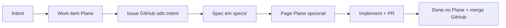

# Plane lifecycle — tarefas e documentação

Complementa [github-lifecycle.md](github-lifecycle.md). GitHub = código; Plane = produto e docs.

## Fluxo recomendado



## Por fase

### 1. Intent

- Criar work item no Plane (Backlog)
- Criar issue GitHub espelhada (`gh-issue-intent.ps1` ou GitHub MCP)
- Linkar nos dois: comentário no Plane com `#N` GitHub; issue GitHub com link Plane

### 2. Spec

- Spec declarativa em `specs/` (fonte de verdade técnica)
- Opcional: `create_project_page` no Plane para ADR ou visão de produto
- Work item Plane → estado "Spec" ou equivalente

### 3. Implement

- Work item → In Progress
- Branch `feat/<issue>-<slug>` no GitHub
- Comentários de progresso via `create_work_item_comment`

### 4. Review / Done

- PR aberto no GitHub; work item → In Review
- Após merge: work item → Done; comentário com link do PR

## Comandos úteis (via agente MCP)

| Objetivo | Tools Plane |
|----------|-------------|
| Listar backlog | `list_work_items` + filtros de estado |
| Criar tarefa | `create_work_item` |
| Buscar RPG-42 | `retrieve_work_item_by_identifier` |
| Sprint planning | `create_cycle`, `transfer_cycle_work_items` |
| Doc de produto | `create_project_page`, `retrieve_project_page` |

## Verificação

```powershell
.\launch.ps1          # Cursor com .env
.\.sdlc\scripts\plane-mcp-check.ps1
```

Setup completo: [.sdlc/integrations/plane.md](../integrations/plane.md)
