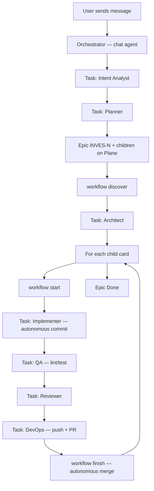

# AI-Native SDLC Guide — sdlc-ai

> **Who this document is for:** you, the human in the loop, who wants to understand how the system works end to end — without reading dozens of scattered files.  
> **Workflow version:** P0 + P1 (2026-05-27)  
> **Complementary technical reading:** [`SDLC-basic.txt`](SDLC-basic.txt) (initialization spec) · [`docs/sdlc/master-workflow.md`](docs/sdlc/master-workflow.md) (approved process)  
> **In-depth reading (papers + behavior):** [`SDLC-DEEP-DIVE.md`](SDLC-DEEP-DIVE.md) — **recommended if you still have questions about P0/P1**

---

## 1. What is this repository?

`sdlc-ai` **is not just an app**. It is a **development operating system** designed for teams where AI agents and humans work together.

| Layer | What it contains | Analogy |
|--------|--------------|----------|
| **Governance** | Rules, gates, Doctor | Project "constitution" |
| **Process** | Workflow, Plane, gitflow | "Operations manual" |
| **Agents** | Subagents, skills, Orchestrator | "Virtual team" |
| **Product** | `app/backend`, `app/frontend` | The software you want to build |

Today the product is intentionally a **placeholder** (`app/` is almost empty) — to exercise the SDLC on a real greenfield.

---

## 2. Five-minute overview

When you send a message in chat (e.g. *"Create a financial app from scratch"*):



**Three central ideas:**

1. **Orchestrator coordinates, does not implement** — the chat does not edit `app/` directly; it spawns subagents via `Task(...)`.
2. **Plane tracks everything** — cards `INVES-N` in project `investiments`; the plan lives on Plane, not in local `specs/`.
3. **Mechanical gates** — the hook blocks writes to `app/` until the gate opens with `workflow start`.

---

## 3. Documentation layers (where to look for what)

| Layer | File | When to read |
|--------|---------|------------|
| **L0 — Entry** | [`AGENTS.md`](AGENTS.md) (root) | Agent reads **first** on every new chat — one-page decision tree |
| **L1 — Process** | [`docs/sdlc/master-workflow.md`](docs/sdlc/master-workflow.md) | Full approved flow (Steps 0–8) |
| **L1 — Authority** | [`docs/sdlc/change-lifecycle.md`](docs/sdlc/change-lifecycle.md) | Gitflow, Plane, merge — **prevails** over ad hoc instructions |
| **L2 — Machine** | `.sdlc/gate-paths.yaml`, `.sdlc/plane-granularity.yaml` | Scripts, hooks, and CLI read from here |
| **Handbook** | [`.sdlc/HANDBOOK.md`](.sdlc/HANDBOOK.md) | Table of subagents, skills, MCPs |
| **This guide** | `SDLC-GUIDE.md` | Human context — the "why" behind each piece |

**Golden rule:** if the chat contradicts `change-lifecycle.md` or `master-workflow.md`, the chat is wrong.

---

## 4. Orchestrator vs subagents

### Orchestrator (chat agent)

This is who you talk to in Cursor. Role: **project manager**, not developer.

| Can do | Cannot do |
|------------|----------------|
| Read files, answer questions | `Write` in `app/backend`, `app/frontend`, `app/shared` |
| Run CLI meta-tools (`workflow status`, `validate-all`) | `git commit`, `git push` |
| Spawn `Task(subagent)` | `pytest`, `ruff`, `npm build` |
| Read handoff YAML and spawn next Task | Create a monolithic `[AI][FULLSTACK]` card |

Rules that enforce this:
- `.cursor/rules/001-sdlc-anti-bypass.mdc`
- `.cursor/rules/002-sdlc-orchestrator-principal.mdc`
- `.cursor/rules/003-orchestrator-delegation-only.mdc`

Skill: `.cursor/skills/subagent-delegation/SKILL.md`

### Subagents (specialists via Task)

Each has a file under `.cursor/subagents/`:

| Subagent | Role | Typical autonomy |
|-----------|-------|------------------|
| **Intent Analyst** | Classifies request (GREENFIELD, BUGFIX, etc.) | Always first |
| **Planner** | Creates epic + children on Plane | Via Plane MCP |
| **Architect** | Architecture notes on Plane | No mandatory local ADR |
| **Implementer** | Code + **autonomous commits** | Does not ask human to commit |
| **QA** | Lint, tests, doctor | Minimum checklist |
| **AutoFixer** | Fixes CI/lint failures (max 2 cycles) | Commit on active branch |
| **Reviewer** | APPROVE or ESCALATE | Blocks bad merge |
| **DevOps** | Push, PR, merge, delete branch | Does not ask human to push |

**Handoff:** each subagent returns YAML in `.sdlc/memory/orchestrator-handoff.md`. The Orchestrator reads it and spawns `next_agent` — never continues the work inline.

---

## 5. Plane — epic, children, and why FULLSTACK does not exist

### Problem we solved (P1)

On retest, the agent created **a single card** `[AI][FULLSTACK]` for the whole project. That breaks:
- per-layer tracking (backend vs frontend)
- isolated branches per scope
- focused QA/review
- incremental merge

### Required structure (GREENFIELD / FEATURE)

```
INVES-25  [AI][EPIC] MarketPulse — delivery epic     ← tracking only
├── INVES-26  [AI][BACKEND] API + providers mock/live
├── INVES-27  [AI][FRONTEND] Dashboard + charts
└── INVES-28  [AI][INFRA] Docker compose + Makefile
```

| Intent | Minimum children | Required types (greenfield) |
|--------|------------------|----------------------------------|
| GREENFIELD | 3 | BACKEND + FRONTEND + (INFRA or SHARED) |
| FEATURE | 2 | layers touched by scope |
| BUGFIX / HOTFIX | 1 card OK | — |
| SDLC_META | 1 card OK | changes in `.sdlc/`, `.cursor/` |

Config: `.sdlc/plane-granularity.yaml`  
Validation: `python3 .sdlc/scripts/plane_card.py validate-all --card INVES-N`

**Critical rule:** `workflow start` **never** on the epic — only on children. Each child = 1 branch = 1 full cycle (implement → QA → review → merge).

### Where does the plan live?

- **On Plane** — HTML description (skill `plane-formatting`)
- **Forbidden** — `specs/` folder, local tickets, backlog markdown in the repo

Integration: Plane MCP (`.cursor/mcp.json`) + skills `plane-sdlc`, `plane-task-creation`.

---

## 6. Mechanical gates — what prevents bypass

Doctor measures whether **files exist**. Gates measure whether the **agent obeys at runtime**.

### Components

| Piece | File | Function |
|------|---------|--------|
| Protected paths | `.sdlc/gate-paths.yaml` | Lists what requires an open gate |
| Session state | `.sdlc/memory/session-gate.json` | Cache: card, branch, stage, gate |
| Gate CLI | `.sdlc/scripts/sdlc_gate.py` | open / close / status |
| Cursor hook | `.cursor/hooks/sdlc_gate_hook.py` | Blocks `Write` in `app/` if gate closed |
| Hook registry | `.cursor/hooks.json` | `preToolUse` → Write |

### Gate flow

```
1. Planner validates plan (validate-all)
2. Orchestrator runs: workflow start --card INVES-26 --slug backend-api
   → branch feature/INVES-26-backend-api
   → session-gate.json: stage=implementation, gate=open
3. Now Implementer can write in app/backend/
4. workflow finish → closes gate + merges PR
```

If someone tries `Write` in `app/` **before** step 2, the hook **denies** the operation.

### Autonomy ≠ bypass

When you say *"without interruptions"*, the system interprets:

> Run the **full** pipeline without asking for merge/commit — but **do not skip gates**.

This is explicit in `001-sdlc-anti-bypass.mdc` and in master-workflow.

---

## 7. CLI workflow — deterministic meta-tools

Repeatable Python scripts (AWO / meta-tools pattern):

```bash
python3 .sdlc/dsl/cli.py workflow classify --text "..."
python3 .sdlc/dsl/cli.py workflow plan --card INVES-N      # validate-all
python3 .sdlc/dsl/cli.py workflow discover                 # legacy docs
python3 .sdlc/dsl/cli.py workflow start --card INVES-M --slug backend-api
python3 .sdlc/dsl/cli.py workflow status
python3 .sdlc/dsl/cli.py workflow finish --pr N --card INVES-M
```

Makefile:
```bash
make workflow-status
make workflow-start CARD=INVES-26 SLUG=backend-api STAGE=implementation
make workflow-discover
make sdlc-doctor
```

The Orchestrator **can** run these commands directly. What it **cannot** do is implement code or commit.

---

## 8. Full cycle per child card

For **each** child (e.g. INVES-26):

| # | Who | Action | Evidence |
|---|------|------|-----------|
| 1 | Orchestrator | `workflow start --card INVES-26` | gate open, branch created |
| 2 | Task(Implementer) | code in `app/` + `git commit` | handoff with `commits: [hash]` |
| 3 | Task(QA) | ruff, pytest, doctor if structural | checklist `qa-minimum-checklist` |
| 4 | Task(AutoFixer) | if QA fail, max 2× | fix commit + re-QA |
| 5 | Task(Reviewer) | APPROVE or ESCALATE | documented decision |
| 6 | Task(DevOps) | `git push`, `gh pr create` | PR with delete_branch_on_merge |
| 7 | Orchestrator | `workflow finish` / `auto_merge_pr.py` | merge into `develop`, card Done |

Epic INVES-25 → **Done** when all children are Done.

---

## 9. Git, branches, and merge

Source: `docs/sdlc/change-lifecycle.md`

| Item | Value |
|------|-------|
| Base branch | `develop` |
| Production | `main` |
| Branch pattern | `feature/INVES-N-<slug>` |
| Merge | Squash, autonomous if CI green + Reviewer APPROVE |
| Merge script | `python3 .sdlc/scripts/auto_merge_pr.py --pr N --card INVES-N` |

**Nothing enters `develop` without:** Plane card + branch + PR + green CI.

Skills: `start-change`, `finish-change`, `branch-naming`, `auto-merge-policy`.

---

## 10. Intent Analyst — how the system classifies your request

First subagent after a new message:

| Intent | Meaning | Plane | Example |
|--------|-------------|-------|---------|
| GREENFIELD | New app, placeholders in `app/` | Epic + ≥3 children | "Create MarketPulse from scratch" |
| FEATURE | New functionality in existing app | Epic + ≥2 children | "Add watchlist" |
| BUGFIX | Point fix | 1 card | "Login broken" |
| HOTFIX | Production urgency | 1 card | "API down in prod" |
| SDLC_META | Improvement to SDLC itself | 1 card | "Add gate X" |
| READONLY | Question, explanation | No | "How does Doctor work?" |

File: `.cursor/subagents/intent-analyst.md`  
Skill: `.cursor/skills/intent-classification/SKILL.md`

---

## 11. Discovery hook — greenfield vs legacy docs

Before planning, the script lists docs from previous products:

```bash
make workflow-discover
# or: python3 .sdlc/dsl/cli.py workflow discover
```

Output: `.sdlc/memory/discovery-context.json`

On **GREENFIELD**, the default is to **ignore** legacy contracts/APIs (e.g. `investment-radar-api.md`) — avoids the agent "pasting" old architecture onto a "from scratch" request.

---

## 12. Doctor vs Audit — what each measures

### Doctor (`make sdlc-doctor`)

- **What:** repo structure — folders, YAML, required files, Makefile targets
- **Goal:** 0 FAIL (integration warnings OK)
- **When to run:** after structural change (`.sdlc/`, `.cursor/`, top-level dirs)
- **Does not measure:** whether the agent followed the workflow in a real session

### Audit (`make sdlc-audit`)

- **What:** Autonomy Score + Health Score via `app/infra/sdlc_obs/auditor.py`
- **Goal:** ≥ 90%
- **Produces:** canvas report in `~/.cursor/projects/.../canvases/`

**MarketPulse lesson:** Doctor 99% + agent collapsing pipeline = **mature structure, immature behavior**. That is why gates + rules 001–003 exist.

---

## 13. MCP — Plane and GitHub

Config: `.cursor/mcp.json` (gitignored — credentials in `.env`)

| MCP | Variables | Use |
|-----|-----------|-----|
| Plane | `PLANE_API_KEY`, `PLANE_WORKSPACE_SLUG`, `PLANE_BASE_URL` | Cards, states, Done evidence |
| GitHub | `GITHUB_PERSONAL_ACCESS_TOKEN_CLASSIC` | PR, merge, issues |

| Plane | Value |
|-------|-------|
| Workspace | `investments-sdlc` |
| Project | `investiments` |
| Cards | `INVES-N` |

Skills: `plane-sdlc`, `plane-formatting`, `plane-task-creation`.

---

## 14. Observability (`app/infra/sdlc_obs/`)

Internal SQLite tool — measures the **SDLC process**, not the product app.

```bash
make obs-init      # creates DB
make obs-server    # dashboard http://localhost:7700
make obs-seed      # sample data
```

Legacy hooks: `pre_task.py` / `post_task.py` in `app/infra/sdlc_obs/hooks/`.

**P2 pending:** workflow events (compliance rate) persisted in obs DB.

---

## 15. What you do vs what is automatic

### Automatic (without asking you)

- Classify intent
- Create/update Plane cards (via MCP)
- Implement, commit, lint, test (subagents)
- Push, open PR, merge (if CI green + APPROVE)
- Delete branch after merge
- Close gate

### Only when escalated (human required)

- AutoFixer exhausted 2 cycles and QA still fails
- Reviewer returns **ESCALATE**
- MCP/API credentials unavailable
- Ambiguous product decision outside card scope

### What you can do to help

1. Keep `.env` with Plane/GitHub keys
2. Review gap analysis canvas after a session
3. Approve decisions when you receive ESCALATE
4. Run `make sdlc-doctor` after structural changes you request

---

## 16. Quick glossary

| Term | Meaning |
|-------|-------------|
| **Orchestrator** | Chat agent; coordinates Tasks |
| **Task(subagent)** | Delegation to a specialized subagent in Cursor |
| **Gate** | Mechanical permission to write to protected paths |
| **Epic** | Parent Plane card — tracking only, never `workflow start` |
| **Child card** | Implementable card — 1 branch, 1 cycle |
| **Handoff** | YAML in `.sdlc/memory/orchestrator-handoff.md` |
| **P0** | Enforcement: gates, hooks, CLI, anti-bypass |
| **P1** | Plane granularity + continuous delegation |
| **P2/P3** | Obs DB events, CI app/, validation hooks Spec Kit |

---

## 17. Commands you will use most

```bash
# Structural health
make sdlc-doctor

# SDLC session state
make workflow-status

# Validate Plane plan
python3 .sdlc/scripts/plane_card.py validate-all --card INVES-N

# Move card to In Progress
make plane-in-progress CARD=INVES-26

# Autonomous merge (when PR ready)
make auto-merge-pr PR=32 CARD=INVES-26

# Observability dashboard
make obs-server
```

---

## 18. Open roadmap (P2/P3)

| Phase | Item | Why |
|------|------|---------|
| P1 | Greenfield retest without human interference | Validate runtime compliance |
| P2 | Obs DB — workflow events | Measure % of sessions that follow pipeline |
| P2 | CI pytest/build on `app/` in PR | Real product gate |
| P3 | Post-phase validation hooks (Spec Kit) | Complete card, tests, doctor after each stage |

Detailed analysis: [`docs/sdlc/sdlc-workflow-gap-analysis.md`](docs/sdlc/sdlc-workflow-gap-analysis.md)

---

## 19. Map of important files

```
AGENTS.md                          ← L0: agent reads first
.sdlc/HANDBOOK.md                  ← subagent/skill catalog (not entry point)
SDLC-GUIDE.md                      ← this document (human)
SDLC-basic.txt                     ← SDLC initialization spec
docs/sdlc/master-workflow.md       ← approved process
docs/sdlc/change-lifecycle.md      ← gitflow + Plane (authority)
.cursor/rules/001-003-*.mdc        ← anti-bypass + orchestrator + delegation
.cursor/skills/subagent-delegation ← Orchestrator → Task matrix
.cursor/skills/plane-task-creation ← epic + children
.sdlc/plane-granularity.yaml       ← decomposition rules
.sdlc/gate-paths.yaml              ← protected paths
.sdlc/memory/session-gate.json     ← session gate state
.sdlc/dsl/cli.py workflow          ← meta-tools
```

---

## 20. Frequently asked questions

**Why did the agent still ask for my help on retest?**  
P1 addresses delegation and granularity in the **specification**; runtime validation (new session, active hooks) is still the next step.

**Can I ask to "do everything at once"?**  
Yes — the pipeline runs in full, but across **multiple cards and Tasks**, not in a single monolithic turn.

**Where do I see progress?**  
Plane (cards + comments) + `make workflow-status` + handoff YAML.

**What if I only want a question, no Plane?**  
Intent READONLY → Orchestrator answers directly, no card.

---

*Document generated to accompany P0+P1. Update when P2 closes new gaps.*
