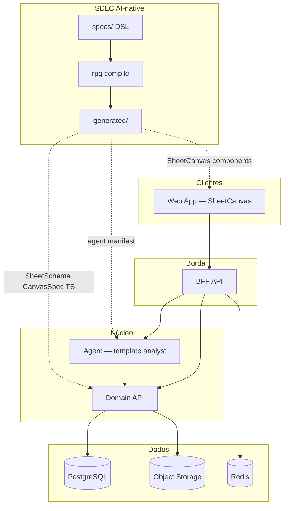
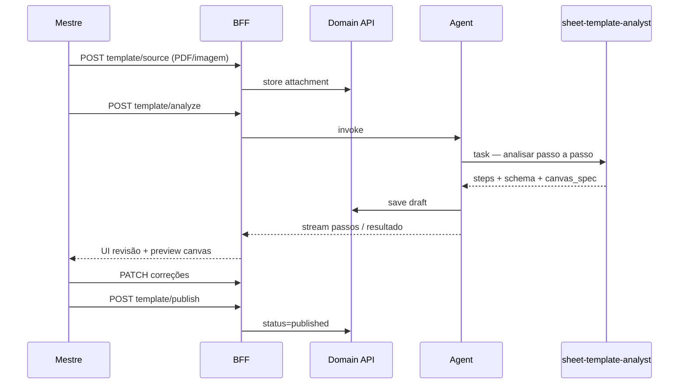
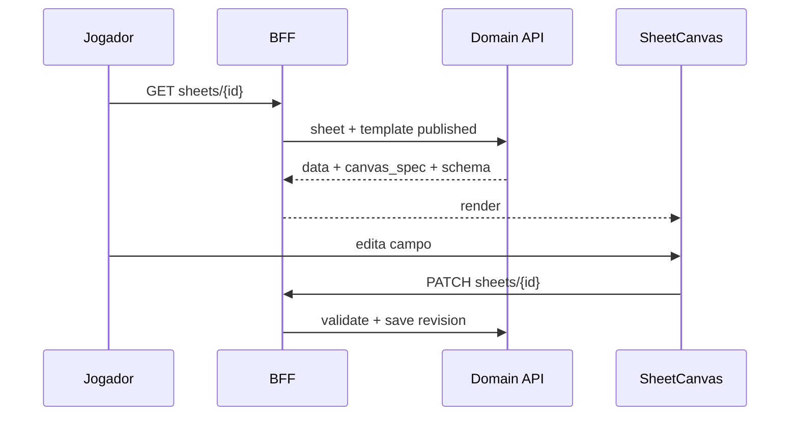

# Arquitetura do sistema


Foco MVP: **template de ficha a partir do exemplo do mestre** + **Sheet Canvas** para jogadores e GM. Detalhes em [08-sheet-canvas.md](08-sheet-canvas.md).


## Visão em camadas





## Responsabilidades por componente


### Web App


- **`SheetCanvas`** — renderiza ficha conforme `canvas_spec` + dados + papel (GM/jogador).

- **Fluxo GM** — upload exemplo → revisão de passos → preview → publicar template → dashboard da campanha.

- **Fluxo jogador** — canvas da própria ficha; edição inline nos campos permitidos.

- Consome BFF (REST; SSE opcional durante análise do template).


### BFF


- Auth, RBAC (GM vs jogador).

- Agrega `sheet` + `canvas_spec` + `template_version` num único payload.

- Proxy para análise de template (stream de passos opcional).

- HITL: publicação de template e remoção de campos.


### Domain API


- Campanhas, personagens, **sheet_templates**, sheets, revisões.

- Valida `data_jsonb` contra `schema_json` do template publicado.

- Upload da ficha exemplo (S3).

- CRUD de fichas **sem LLM** — edição direta no canvas.


### Agent Service


- Orquestrador + **`sheet-template-analyst`** único subagente MVP.

- Análise multimodal do exemplo → `analysis` + `sheet_schema` + `canvas_spec` draft.

- Modo `extend` para campos/seções adicionais.

- Não persiste template publicado — GM confirma via API.


### PostgreSQL


- Templates versionados, fichas, personagens, membros da campanha.


### Object storage


- Ficha exemplo do GM (PDF/imagem).


## Fluxos principais


### 1. GM define template a partir do exemplo





### 2. Jogador usa ficha no canvas





### 3. GM estende template (mais informações)


1. GM descreve novo campo/seção na UI.

2. BFF → Agent (`extend`) → `sheet-template-analyst` propõe patch.

3. GM revisa preview → publica nova `template_version`.

4. Fichas existentes recebem defaults nos campos novos.


## Modelo de dados (MVP)


```

users

campaigns (id, name, owner_id)

campaign_members (campaign_id, user_id, role: gm|player)

sheet_templates (

  id, campaign_id, version, status,

  source_attachment_id,

  analysis_json,

  schema_json,

  canvas_spec_json,

  published_at

)

characters (id, campaign_id, name, player_user_id)

sheets (id, character_id, template_id, template_version, data_jsonb, revision)

sheet_revisions (id, sheet_id, data_jsonb, source, created_at)

attachments (id, campaign_id, storage_key, mime, kind: template_source|other)

```


## Monorepo


```

rpg-op/

├── specs/

│   ├── templates/           # SheetSchema, CanvasSpec IR

│   ├── agents/

│   │   ├── orchestrator.py

│   │   └── sheet_template_analyst.py

│   └── api/

├── packages/

│   └── rpg_dsl/

├── generated/

├── apps/

│   └── web/

│       └── components/

│           └── SheetCanvas/   # stat_row, field_grid, rich_text, ...

├── services/

│   ├── domain/

│   └── agent/

├── skills/workflows/

│   ├── template-analysis/

│   └── template-extend/

└── docs/

```


## Contrato BFF (MVP)


| Método | Rota | Uso |

|--------|------|-----|

| POST | `/v1/campaigns/{id}/template/source` | Upload ficha exemplo |

| POST | `/v1/campaigns/{id}/template/analyze` | Inicia análise |

| GET | `/v1/campaigns/{id}/template` | Draft ou published |

| PATCH | `/v1/campaigns/{id}/template` | GM corrige schema/canvas |

| POST | `/v1/campaigns/{id}/template/publish` | Publica versão |

| POST | `/v1/campaigns/{id}/template/extend` | Novos campos/seções |

| GET | `/v1/campaigns/{id}/sheets` | GM — todas as fichas |

| GET | `/v1/sheets/{id}` | Dados + canvas_spec |

| PATCH | `/v1/sheets/{id}` | Salvar ficha |


## Segurança


- Jogador: read/write só na própria ficha; campos `readonly` via `canvas_spec.role_overrides`.

- GM: todas as fichas da campanha; único que publica template.

- Agente: acesso ao anexo exemplo e drafts; não publica template sem HITL.


## Domain API vs Agent


| Operação | Via |

|----------|-----|

| Editar valor na ficha | Domain API |

| Analisar PDF exemplo | Agent |

| Publicar template | Domain API (após aprovação GM) |

| Validar dados | Domain API (JSON Schema) |


Ver também [03-deep-agent-harness.md](03-deep-agent-harness.md), [06-sdlc-ai-native.md](06-sdlc-ai-native.md).

