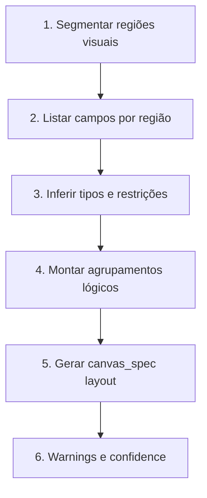
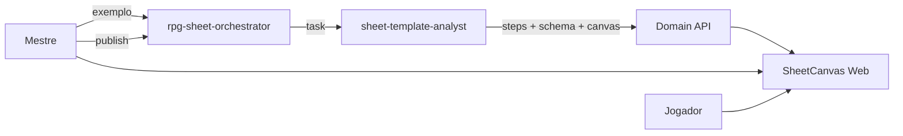

# Deep Agent Harness — foco em template de ficha

Harness enxuto para o MVP: **analisar a ficha exemplo do mestre** e gerar schema + canvas. Demais cenários (combat, rules, leveling, …) ficam fora do escopo inicial.

Ver fluxo completo em [08-sheet-canvas.md](08-sheet-canvas.md).

## Agentes

| Agente | Responsabilidade |
|--------|------------------|
| **`rpg-sheet-orchestrator`** | Upload, delegação, extensão de template, publicação com HITL |
| **`sheet-template-analyst`** | Análise passo a passo do exemplo → `sheet_schema` + `canvas_spec` |

Não há subagentes por cenário de jogo no MVP.

## Orquestrador

**Entradas típicas:**

- GM enviou ficha exemplo → delegar análise
- GM pediu campo/seção extra → delegar `extend`
- Jogador/GM editou dados → **Domain API direto** (sem agente), salvo pedido explícito de assistência

**System prompt (resumo):**

- Uma campanha tem um template derivado do exemplo do GM.
- Não inventar campos que não aparecem na análise sem pedido do GM.
- Publicação de template sempre passa por revisão humana.

## `sheet-template-analyst`

### Entrada

- Anexo multimodal (`read_file` em PDF/PNG/JPG)
- Opcional: notas do GM (“ignore a coluna da direita”, “homebrew de magia”)

### Processo (passos expostos ao GM)



Cada passo vira entrada em `analysis.steps[]` para a UI de revisão.

### Saída

`TemplateAnalysisResult`:

- `steps` — narrativa da análise
- `sheet_schema` — campos, seções, tipos
- `canvas_spec` — regiões, ordem, `presentation`, overrides GM/jogador
- `warnings` — baixa confiança, texto ilegível, ambiguidade

### Modos

| Modo | Trigger | Comportamento |
|------|---------|---------------|
| `analyze` | Primeiro upload | Análise completa |
| `extend` | GM adiciona informação | Patch incremental schema + canvas |
| `reanalyze` | GM reenviou exemplo | Nova versão draft; não sobrescreve published sem confirmar |

## Tools

| Tool | Uso |
|------|-----|
| `get_template_source(campaign_id)` | URL/path do exemplo |
| `save_template_draft(campaign_id, result)` | Persiste draft pós-análise |
| `propose_template_extension(campaign_id, patch)` | Extensão de campos/seções |
| `get_sheet(sheet_id)` | Leitura (orquestrador, futuro assistente) |
| `patch_sheet(sheet_id, data)` | Via Domain API; validação schema |

## Skills

```
skills/
├── core/
│   └── rpg-etiquette/
└── workflows/
    ├── template-analysis/      # Passo a passo análise visual
    ├── template-extend/        # Adicionar campos/seções
    └── canvas-layout/          # Mapear region → presentation
```

## Human-in-the-loop

| Ação | HITL |
|------|------|
| Salvar draft de análise | Não |
| **Publicar template** | Sim |
| **Remover campo com dados** | Sim |
| Editar ficha (jogador/GM) | Não (validação schema only) |

## Filesystem virtual

```
/workspace/campaigns/{id}/templates/drafts/
/workspace/campaigns/{id}/templates/analysis/
/skills/workflows/template-analysis/
```

## Observabilidade

LangSmith metadata: `campaign_id`, `template_version`, `analysis_mode`, `step_count`, `confidence`.

Evals MVP: fixtures com 2–3 imagens de ficha anonimizadas → schema mínimo esperado (campos críticos presentes).

## Diagrama



## Fase posterior (não implementar agora)

- Assistente conversacional sobre a ficha
- Subagente de import OCR de fichas preenchidas de jogadores
- Plugins registry D&D/Tormenta como atalho em vez de upload
