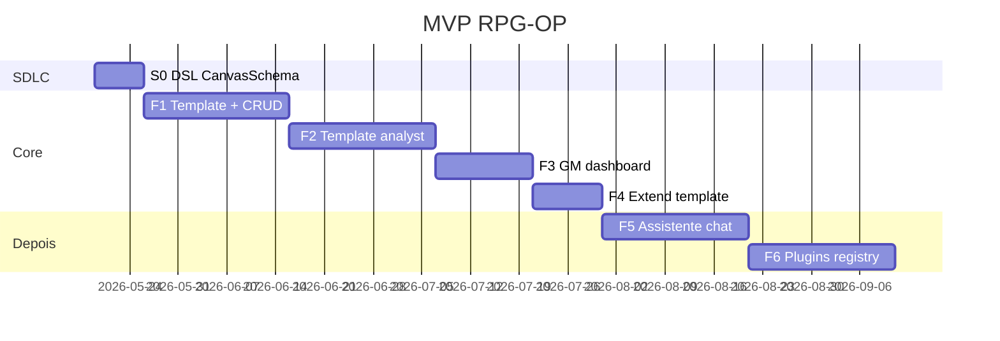

# Roadmap — foco Sheet Canvas

Roadmap alinhado ao MVP: **ficha visual**, **template do exemplo do mestre**, **um subagente analista**. Cenários extras (combat, chat, plugins D&D) ficam fora até validar o core.

Documento central: [08-sheet-canvas.md](08-sheet-canvas.md).

## Visão geral

---

## S0 — DSL `SheetSchema` + `CanvasSpec` (~1 semana)

**Entregas**

- [ ] IR na DSL: `Field`, `Section`, `CanvasRegion`, `PresentationType`.
- [ ] `rpg compile --target pydantic|typescript`.
- [ ] Tipos TS para props do `SheetCanvas`.

**Critério de saída:** spec estática de exemplo compila para Pydantic + TS.

---

## F1 — Campanha, template manual, canvas estático (2–3 semanas)

**Objetivo:** GM e jogador veem ficha no canvas **sem LLM** (schema/canvas colados manualmente ou fixture).

**Entregas**

- [ ] Postgres: `campaigns`, `sheet_templates`, `characters`, `sheets`, `sheet_revisions`.
- [ ] Domain API + BFF (rotas template + sheets).
- [ ] `SheetCanvas` com `stat_row`, `field_grid`, `rich_text`.
- [ ] GM dashboard: lista fichas da campanha.
- [ ] Jogador: edita própria ficha.
- [ ] Docker Compose.

**Critério de saída:** campanha piloto com template fixture; jogadores preenchem no canvas.

---

## F2 — Subagente `sheet-template-analyst` (2–3 semanas)

**Objetivo:** GM envia ficha exemplo → análise passo a passo → draft schema + canvas.

**Entregas**

- [ ] Upload `template/source`.
- [ ] Agent + subagente multimodal (`read_file` PDF/imagem).
- [ ] Skill `template-analysis`.
- [ ] UI revisão: passos + preview canvas lado a lado com imagem original.
- [ ] `POST template/publish` com HITL.
- [ ] LangSmith + eval smoke (2 fixtures anonimizados).

**Critério de saída:** GM publica template derivado do PDF real da mesa sem editar JSON à mão.

---

## F3 — Polish GM / jogador (1–2 semanas)

**Entregas**

- [ ] `role_overrides` no canvas (GM edita XP, jogador não).
- [ ] Indicadores de campos vazios / incompletos no dashboard GM.
- [ ] Histórico básico de revisões da ficha.
- [ ] Responsivo (tablet na mesa).

**Critério de saída:** GM controla visão da campanha numa sessão real.

---

## F4 — Extensão de template ( ~1–2 semanas)

**Entregas**

- [ ] `POST template/extend` + modo `extend` do subagente.
- [ ] Nova versão de template; migração soft (defaults em fichas existentes).
- [ ] UI: “Adicionar seção/campo”.

**Critério de saída:** GM adiciona campo sem reupload do PDF.

---

## F5+ — Backlog (não MVP)

| Fase | Conteúdo |
|------|----------|
| F5 | Chat assistente sobre a ficha |
| F6 | System registry com presets (D&D, Tormenta) como atalho |
| — | Import OCR de fichas preenchidas de jogadores |
| — | App móvel, async analysis, RAG regras |

---

## Riscos

| Risco | Mitigação |
|-------|-----------|
| Análise errada do PDF | UI de passos + preview; GM corrige antes de publish |
| Canvas não fiel ao papel | `presentation` types + ordem de regiões do analyst |
| Schema instável | Versionamento de template; PATCH validado |
| Custo LLM | Análise só no setup; edição de ficha sem agente |

---

## Próximos passos

1. GM fornece **PDF/foto real** da ficha da mesa (anonimizada) para fixture de eval.
2. Implementar **S0 + F1** — canvas + CRUD sem agente.
3. **F2** — subagente analista sobre o exemplo real.
