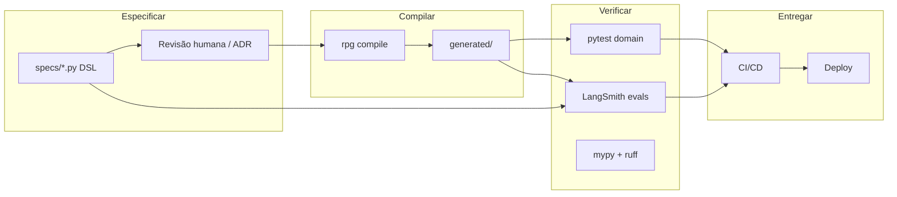
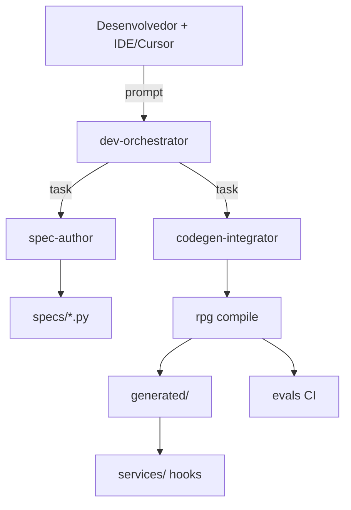
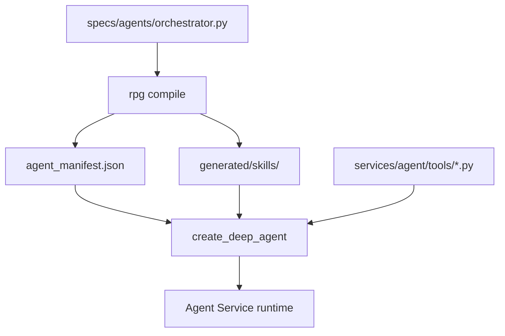

# SDLC AI-native e DSL Python

Este documento define como o **desenvolvimento do próprio RPG-OP** segue um ciclo de vida orientado a agentes, com uma **DSL em Python** como fonte única de verdade para domínio, contratos, harness e evals.

## Por que SDLC AI-native?

O produto **é** um sistema de agentes. Faz sentido que a engenharia use o mesmo paradigma:

| Tradicional | AI-native (RPG-OP) |
|-------------|---------------------|
| PRD em Notion + código diverge | **Spec em Python (DSL)** versionada no git |
| Prompts espalhados em strings | **Skills e subagentes** gerados/validados a partir da DSL |
| Testes só de API | **Evals de agente** como gate de CI |
| Dev assistido ad hoc | **Dev harness** (Deep Agent) com skills de engenharia |
| Schema duplicado (BE/FE/agent) | **Compilador DSL** emite Pydantic, OpenAPI, TS, manifests |

Objetivo: humanos e agentes de coding editam **artefatos declarativos**; o runtime e a documentação são **derivados**.

## Visão do ciclo



## Pacote `rpg_dsl` — DSL em Python

A DSL **não é uma linguagem separada**: é Python tipado com builders e decoradores, legível por humanos e por LLMs, validável com **mypy** e **ruff**.

### Princípios da DSL

1. **Executable spec** — arquivos em `specs/` importam e rodam; erros são exceções em tempo de compilação.
2. **Progressive disclosure** — começar com `@sheet` e `@field`; evoluir para `@workflow`, `@eval` sem quebrar v1.
3. **Idempotência** — `rpg compile` sobrescreve `generated/`; nunca editar `generated/` à mão.
4. **Diff-friendly** — specs por plugin (`specs/systems/dnd5e/`) e por cenário (`specs/agents/scenarios/`).
5. **Simetria produto/dev** — mesmos conceitos de skill, subagente e tool no domínio RPG e no domínio engenharia.

### Estrutura no monorepo

```
rpg-op/
├── .sdlc/                      # Harness SDLC AI-native (dev Deep Agent)
│   ├── AGENTS.md               # Memória dev orchestrator
│   ├── config.yaml
│   ├── phases.yaml
│   ├── agents/                 # dev-orchestrator + subagentes
│   ├── skills/                 # dsl-authoring, compile-workflow, …
│   ├── workflows/
│   ├── commands/               # comandos agentic + scripts locais
│   └── scripts/validate.ps1
├── .cursor/                    # Regras, skills e hooks Cursor IDE
│   ├── AGENTS.md               # → .sdlc/AGENTS.md
│   ├── agents/                 # Adapters Cursor para agentes canônicos
│   ├── rules/*.mdc
│   └── skills/sdlc-orchestrator/
├── specs/                      # Fonte da verdade (DSL Python)
│   ├── templates/              # SheetSchema, CanvasSpec, TemplateAnalysisResult
│   ├── agents/
│   │   ├── orchestrator.py
│   │   └── sheet_template_analyst.py
│   ├── api/
│   └── evals/
│       └── template_analysis/
├── packages/
│   └── rpg_dsl/
├── generated/
├── backend/                    # MVP F1 — FastAPI
├── apps/web/                   # MVP F1 — React + Vite
└── services/agent/             # Deep Agent produto (F2+)
```

Ver [.sdlc/README.md](../.sdlc/README.md) e [.cursor/README.md](../.cursor/README.md).

### IR (representação interna)

O compilador normaliza specs para uma IR (Pydantic/dataclasses):

- `DomainSpec`, `SheetSpec`, `FieldSpec`, `ComputedSpec`
- `SheetSchemaSpec`, `CanvasSpec`, `CanvasRegion`, `PresentationType`
- `TemplateAnalysisResult`, `AnalysisStep`
- `ScenarioAgentSpec` (fase posterior)
- `RouteSpec`, `DtoSpec`, `PermissionSpec`
- `EvalScenario`, `EvalAssertion`

Isso permite múltiplos **backends de emissão** sem acoplar a sintaxe do `@decorator`.

## Elementos da DSL (API de autores)

### Schema de ficha e canvas (MVP)

```python
# specs/templates/canvas_spec.py
from rpg_dsl import Canvas, Region, Field, Presentation

@Canvas(version=1)
class ExampleLayout:
    header = Region(
        title="Personagem",
        order=0,
        presentation=Presentation.FIELD_GRID,
        fields=[Field.key("character_name"), Field.key("class_name")],
    )
```

```python
# specs/agents/sheet_template_analyst.py
@SubAgent(name="sheet-template-analyst", response_model="TemplateAnalysisResult")
class SheetTemplateAnalyst:
    skills = ["workflows/template-analysis/"]
```

Ver [08-sheet-canvas.md](08-sheet-canvas.md).

### API BFF (contrato)

```python
# specs/api/bff_v1.py
from rpg_dsl import Route, GET, POST, api

@api(prefix="/v1", tag="sheets")
class SheetsV1:
    @GET("/sheets/{sheet_id}", response="SheetDetailDto")
    def get_sheet(self, sheet_id: str) -> None: ...

    @POST("/assistant/threads/{thread_id}/messages", stream=True)
    def post_message(self, thread_id: str, body: "AssistantMessageDto") -> None: ...
```

### Evals (comportamento do agente)

```python
# specs/evals/sheet_queries.py
from rpg_dsl import Eval, assert_contains, assert_tool_called

@Eval(suite="sheet-queries", tags=["dnd5e", "smoke"])
class StrengthModQuery:
    fixture = "fixtures/dnd5e_fighter.json"
    user_message = "Qual meu modificador de Força?"
    assertions = [
        assert_tool_called("get_sheet"),
        assert_contains("+3"),  # para STR 16 no fixture
    ]
```

## Compilador — artefatos gerados

Comando: `rpg compile [--target pydantic|openapi|agent|skills|evals|all]`

| Target | Saída | Consumidor |
|--------|-------|------------|
| `pydantic` | `generated/pydantic/sheets/dnd5e_v1.py` | Domain API, tools |
| `jsonschema` | `generated/schemas/dnd5e_v1.json` | Validação, frontend |
| `openapi` | `generated/openapi/bff_v1.yaml` | BFF, clientes, app móvel |
| `typescript` | `generated/typescript/api.ts` | Web app |
| `agent_manifest` | `generated/agent_manifest/orchestrator.json` | `create_deep_agent(subagents=...)` |
| `skills` | `generated/skills/.../SKILL.md` | Deep Agent skills dir |
| `evals` | `generated/evals/sheet_queries.json` | LangSmith upload / CI |
| `registry` | `generated/registry/manifest.json` | SystemRegistry, UI, Domain API |
| `permissions` | `generated/agent_manifest/permissions.json` | Harness `permissions=` |
| `cursor_rules` | `.cursor/rules/generated-*.mdc` | Contexto IDE (derivado) |

### Hooks manuais (não gerados)

Lógica que **não** deve ir na DSL:

- Implementação de tools (`services/agent/tools/get_sheet.py`) — corpo Python real.
- Queries SQL, transações, auth middleware.
- Componentes React — consomem tipos gerados.

A DSL declara **assinatura e contrato**; o serviço implementa **efeitos colaterais**.

## Dev harness — agente de engenharia

Espelha o harness de produto, com skills de SDLC:

| Subagente dev | Função |
|---------------|--------|
| `spec-author` | Edita `specs/` seguindo convenções DSL |
| `codegen-integrator` | Roda compile, integra hooks em `services/` |
| `eval-engineer` | Escreve/atualiza `specs/evals/` |
| `sdlc-doctor` | Avalia saúde do SDLC AI-native, drift, gates e integrações |
| `system-author` | Cria plugin `@system` + extensões de cenário |

Skills em `.sdlc/skills/` (também referenciadas em `.cursor/skills/` quando útil):

- `dsl-authoring/SKILL.md` — gramática da DSL, exemplos.
- `compile-workflow/SKILL.md` — ordem: validate → compile → test → eval.
- `safe-refactor/SKILL.md` — nunca editar `generated/`.
- `deep-agent-harness/SKILL.md` — create_deep_agent, subagentes, HITL.
- `sdlc-doctor/SKILL.md` — diagnóstico de saúde, maturidade e prontidão do SDLC.

### Fronteira `.sdlc/agents` vs `.cursor/agents`

| Camada | Responsabilidade |
|--------|------------------|
| `.sdlc/agents/` | Catálogo canônico operacional: YAMLs com `name`, `type`, skills, tools, permissões e `system_prompt`. |
| `.cursor/agents/` | Adapters de IDE: quando chamar cada agente no Cursor, exemplos de delegação e links para o YAML canônico. |
| `.cursor/rules/` | Contexto automático da IDE por escopo de arquivo ou workflow. |

Regra: configuração operacional não deve ser duplicada em `.cursor/agents/`.

O **Dev Orchestrator** usa as mesmas primitives Deep Agents (`task`, filesystem, HITL em `edit_file` em `specs/`).

### Commands

Commands em `.sdlc/commands/` agrupam skills, agentes e procedimentos
reutilizáveis. Eles podem apontar para scripts locais ou playbooks agentic.

| Command | Função |
|---------|--------|
| `plane_backlog_plan` | Analisa uma intent e cria/atualiza work items no Plane |
| `technical_documentation` | Cria ou atualiza documentação técnica versionada |
| `business_documentation` | Cria ou atualiza documentação de negócio e Plane Pages |



## Integrações — GitHub MCP + lifecycle

O SDLC completo conecta **Deep Agent (dev)** ao **GitHub** via MCP no Cursor, `gh` CLI e Actions.

| Camada | Path |
|--------|------|
| MCP Cursor | `.cursor/mcp.json` |
| Integração | `.sdlc/integrations/github.md` |
| Workflow | `.sdlc/workflows/github-lifecycle.md` |
| Comandos | `.sdlc/commands/commands.yaml` |
| CI | `.github/workflows/sdlc.yml` |
| Templates | `.github/ISSUE_TEMPLATE/`, `PULL_REQUEST_TEMPLATE.md` |

### Setup GitHub (resumo)

1. PAT com scopes `repo`, `workflow` → `GITHUB_PERSONAL_ACCESS_TOKEN`
2. Cursor v0.48+; reiniciar após editar `mcp.json`
3. `gh auth login` + `.sdlc/scripts/gh-labels-bootstrap.ps1`
4. Subagente dev: `github-integrator` — skill `github-sdlc`

Plataformas futuras: `.sdlc/integrations/platforms.yaml` (LangSmith, Linear, deploy).

## Fases do SDLC AI-native

| Fase | Atividade | Gate GitHub |
|------|-----------|-------------|
| **1. Intent** | Issue SDLC | Template `sdlc-intent`, label `sdlc:intent` |
| **2. Spec** | DSL em `specs/` | Branch + `sdlc:spec` |
| **3. Compile** | `rpg compile` | Commit |
| **4. Implement** | Hooks | `validate.ps1`, `sdlc:implement` |
| **5. Eval** | LangSmith | `sdlc:eval` (F2+) |
| **6. Review** | PR | Workflow SDLC verde |
| **7. Deploy** | Release | Actions (backlog) |

### Regras de PR (AI-native)

- Mudança de comportamento de ficha ou agente **exige** diff em `specs/`.
- PR que toca `specs/agents/` ou `specs/evals/` **exige** eval smoke verde.
- `generated/` pode ser commitado (review explícito) ou gerado só no CI — escolher uma política e manter.

Recomendação MVP: **commitar `generated/`** para PRs legíveis e diffs de contrato visíveis.

## CI/CD estendido

```yaml
# .github/workflows/sdlc.yml (implementado)
jobs:
  sdlc-gates:
    run: validate + backend import check + pytest
```

Ver também `.sdlc/workflows/github-lifecycle.md`.

## Relação DSL ↔ Deep Agent (produto)



- **Manifest** alimenta `subagents`, `skills`, `interrupt_on`, `permissions`.
- **Tools** registradas no runtime mapeiam `ToolRef("get_sheet")` → função Python importada.
- Alterar subagente = editar spec → compile → redeploy (sem caçar strings no código).

## Versionamento e migração

- `SheetSpec.version` incrementa com breaking changes em campos.
- Compilador emite `SheetMigrator` (funções `v1 → v2`) quando `@sheet` declara `migrations_from`.
- `sheet_revisions` guarda `schema_version` para replay.

## Anti-padrões

| Evitar | Preferir |
|--------|----------|
| Lógica de negócio RPG dentro de prompts | `@Computed`, tools, Domain API |
| Copiar schema manualmente no frontend | `rpg compile --target typescript` |
| Subagente definido só em Python imperativo | `specs/agents/*.py` + manifest |
| Eval ad hoc em notebook | `specs/evals/` versionados |
| Agente dev editando `generated/` | HITL + skill `compile-workflow` |

## Métricas de maturidade SDLC

| Nível | Critério |
|-------|----------|
| L0 | Specs só para schema de ficha |
| L1 | + manifest de agente gerado |
| L2 | + evals smoke em CI |
| L3 | + dev harness com spec-author |
| L4 | + migrações de sheet geradas; RAG rules na DSL |

Meta inicial do projeto: **L2** ao fim da F2 (roadmap produto).

## Próximo passo de implementação

1. Implementar `packages/rpg_dsl` mínimo (`@Field`, `@Canvas`, `rpg validate`, `rpg compile --target pydantic`).
2. Primeira spec real em `specs/templates/` alinhada ao backend MVP.
3. Wire dev orchestrator YAML → runtime Deep Agent em `services/agent/dev/` (F2 SDLC L3).

Harness SDLC já scaffolded em **`.sdlc/`** e **`.cursor/`**.
