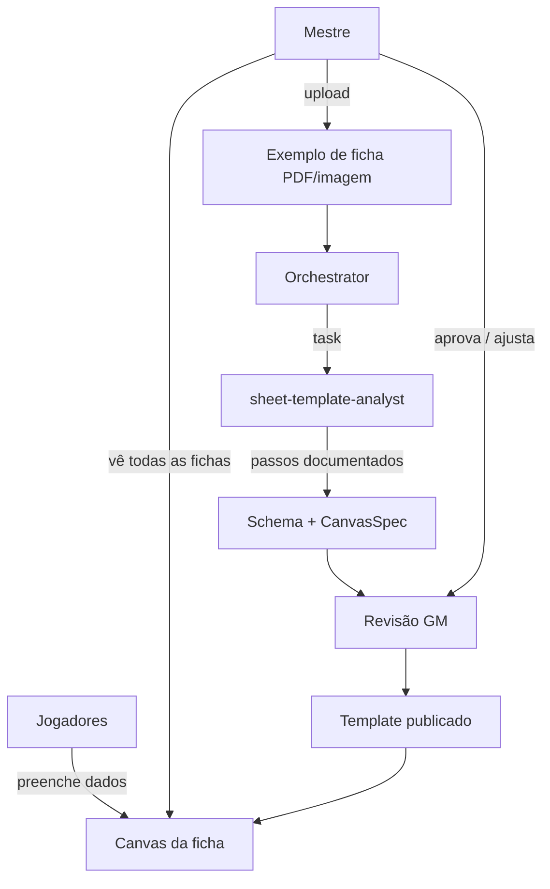
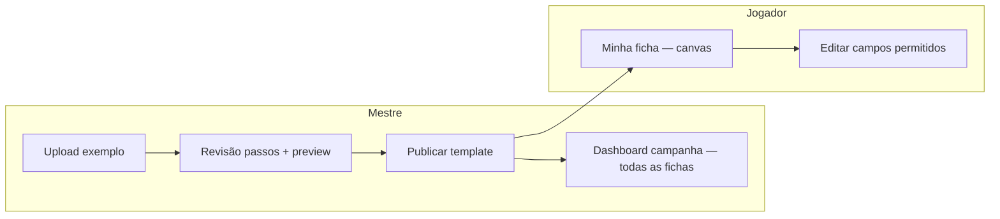

# Sheet Canvas — ficha visual a partir do exemplo do mestre

Foco atual do produto: **apresentar fichas** para jogadores e mestre, com layout fiel ao que a mesa já usa. O mestre envia uma **ficha exemplo real**; um subagente analisa passo a passo, constrói **schema de dados** + **especificação de canvas**; jogadores preenchem e consultam fichas nesse layout.

## O que mudou em relação ao plano anterior

| Antes | Agora (MVP) |
|-------|-------------|
| Muitos subagentes por cenário (combat, leveling, …) | **Um subagente central** de análise de template + orquestrador leve |
| Schemas pré-definidos (D&D, Tormenta, …) | Schema **derivado do exemplo** que o GM fornece |
| UI genérica / form builder | **Canvas** gerado para espelhar a ficha real |
| Assistente conversacional amplo | Edição e visualização na ficha; chat secundário (fase posterior) |

## Fluxo principal



## Atores e permissões

| Ator | Pode |
|------|------|
| **Mestre** | Enviar ficha exemplo; revisar schema/canvas; publicar template; ver todas as fichas da campanha; adicionar campos/seções; editar qualquer ficha (configurável) |
| **Jogador** | Ver e editar **a própria** ficha no canvas publicado |
| **Subagente** | Analisar exemplo, propor schema/canvas, propor extensões — **não publica** sem GM |

## Artefatos

### 1. Ficha exemplo (`template_source`)

Upload do GM: PDF, PNG, JPG ou foto da ficha de papel que a mesa já usa.

Armazenado em object storage; referenciado pela campanha como origem do template.

### 2. Análise por passos (`template_analysis`)

O subagente documenta cada etapa (visível ao GM na UI de revisão):

```yaml
steps:
  - id: step-1
    label: "Identificar regiões da página"
    finding: "Cabeçalho com nome/classe; bloco central de atributos; coluna direita de combate"
  - id: step-2
    label: "Extrair campos do cabeçalho"
    fields:
      - key: character_name
        label: "Nome do personagem"
        type: string
        region: header
  - id: step-3
    label: "Mapear tabela de atributos"
    fields:
      - key: strength
        label: "FOR"
        type: integer
        region: attributes
        constraints: { min: 1, max: 30 }
  # ...
```

Persistido como JSON auditável; alimenta revisão humana e evals.

### 3. Schema de dados (`sheet_schema`)

Modelo versionado gerado pela análise + ajustes do GM:

- Campos tipados (`string`, `integer`, `boolean`, `text`, `list`, `table`, …)
- Agrupamentos lógicos (`section_id`)
- Obrigatoriedade, limites, defaults
- Campos **extras** adicionados depois pelo GM (`extensions[]`)

Compilado para Pydantic/JSON Schema via DSL (SDLC AI-native).

### 4. Canvas spec (`canvas_spec`)

Descreve **como apresentar** os dados — não só quais campos existem:

```yaml
canvas:
  version: 1
  layout: regions          # ou grid, freeform
  regions:
    - id: header
      title: "Personagem"
      order: 0
      columns: 2
      fields: [character_name, player_name, class, level]
    - id: attributes
      title: "Atributos"
      order: 1
      presentation: stat_row   # linha FOR/DES/...
      fields: [strength, dexterity, constitution, ...]
    - id: notes
      title: "Anotações"
      order: 99
      presentation: rich_text
      fields: [notes]
  styling:
    density: compact
    show_labels: true
  role_overrides:
    player:
      readonly_fields: [xp_total]   # exemplo: só GM edita XP
    gm:
      readonly_fields: []
```

Runtime: componente **`SheetCanvas`** no web app recebe `canvas_spec` + `data` + `role` e renderiza layout consistente para mesa e jogadores.

> **Nota:** isto é o canvas **do produto** (React no web app). É independente do Cursor Canvas (`.canvas.tsx` no IDE), embora o conceito seja o mesmo — artefato visual autocontido.

### 5. Instância de ficha (`sheet`)

Dados do personagem validados contra `sheet_schema` + `template_version`:

```
sheets (id, campaign_id, character_id, template_id, template_version, data_jsonb, revision, ...)
```

## Subagentes (escopo MVP)

| Agente | Papel |
|--------|-------|
| **`rpg-sheet-orchestrator`** | Coordena upload, delega análise, apoia extensão de template |
| **`sheet-template-analyst`** | **Núcleo:** lê exemplo multimodal, decompõe em passos, emite schema + canvas_spec |

Cenários adiados (fora do MVP): combat, leveling, rules Q&A, lore, import batch, etc.

### `sheet-template-analyst` — comportamento

1. **Segmentar** a imagem/PDF em regiões (cabeçalho, tabelas, listas, notas).
2. **Nomear** cada campo visível com `key` estável (snake_case).
3. **Inferir tipo** e restrições quando possível; marcar `confidence: low` quando incerto.
4. **Propor layout** no `canvas_spec` alinhado à disposição visual (ordem, colunas, tabelas).
5. **Emitir passos** legíveis para o GM validar (“passo 3: encontrei 6 atributos na linha central”).
6. **Extensibilidade:** endpoint/skill para “adicionar seção/campo” preservando versão anterior.

Saída estruturada (`response_format` Pydantic):

```python
class TemplateAnalysisResult(BaseModel):
    steps: list[AnalysisStep]
    sheet_schema: SheetSchemaDraft
    canvas_spec: CanvasSpecDraft
    warnings: list[str]
    confidence: Literal["high", "medium", "low"]
```

Human-in-the-loop: GM revisa passos + preview do canvas antes de `publish_template`.

## UI — telas principais



### Dashboard do mestre

- Lista de personagens / jogadores
- Miniatura ou link para canvas de cada ficha
- Indicador de template version / campos incompletos
- Ação: “Adicionar informação ao template” (nova seção/campo)

### Vista do jogador

- Canvas full-page da própria ficha
- Campos editáveis inline (conforme `role_overrides`)
- Histórico de revisões (fase 2)

## System Registry (papel reduzido)

O registry deixa de ser catálogo D&D/Tormenta no MVP e passa a registrar **templates de campanha**:

| Entrada | Descrição |
|---------|-----------|
| `campaign_template@{version}` | Schema + canvas_spec derivados do exemplo do GM |
| `generic@v1` | Fallback mínimo se GM ainda não publicou template |

Plugins por sistema (D&D, etc.) ficam **fase posterior** — opcionalmente aceleram análise se GM escolher preset em vez de upload.

## Domain API (endpoints MVP)

| Método | Rota | Uso |
|--------|------|-----|
| POST | `/v1/campaigns/{id}/template/source` | GM envia ficha exemplo |
| POST | `/v1/campaigns/{id}/template/analyze` | Dispara subagente (async ok) |
| GET | `/v1/campaigns/{id}/template/analysis` | Passos + draft schema/canvas |
| PATCH | `/v1/campaigns/{id}/template/analysis` | GM corrige campos/layout |
| POST | `/v1/campaigns/{id}/template/publish` | Congela versão |
| POST | `/v1/campaigns/{id}/template/extend` | Adicionar campos/seções |
| GET | `/v1/sheets/{id}` | Dados + `canvas_spec` resolvido |
| PATCH | `/v1/sheets/{id}` | Atualiza dados (validação schema) |
| GET | `/v1/campaigns/{id}/sheets` | GM: todas as fichas |

## Modelo de dados (esboço)

```
campaigns (id, name, owner_id, ...)
sheet_templates (
  id, campaign_id, version, status,  -- draft | published
  source_attachment_id,
  analysis_json,
  schema_json,
  canvas_spec_json,
  published_at
)
characters (id, campaign_id, name, player_user_id)
sheets (id, character_id, template_id, template_version, data_jsonb, revision)
template_extensions (id, template_id, from_version, patch_json, created_by)
```

## Extensibilidade — “incluir mais informações”

1. GM pede na UI ou via assistente: “Quero campo Montaria e seção Recursos da guilda”.
2. Orquestrador delega ao `sheet-template-analyst` em modo **extend** (não reanalisa tudo).
3. Subagente propõe patch no schema + canvas (nova região ou campos em região existente).
4. GM aprova → nova `template_version`; fichas existentes ganham campos vazios ou defaults.

Regra: extensões **append-only** por padrão; remover campo exige confirmação explícita (dados podem existir).

## Integração Deep Agent

```python
sheet_template_analyst = {
    "name": "sheet-template-analyst",
    "description": "Analisa ficha exemplo (PDF/imagem) passo a passo e gera schema + canvas_spec.",
    "system_prompt": "...",
    "tools": ["get_template_source", "read_file"],  # multimodal
    "skills": ["/skills/workflows/template-analysis/"],
    "response_format": TemplateAnalysisResult,
}

agent = create_deep_agent(
    subagents=[sheet_template_analyst],
    interrupt_on={"publish_template": True},  # GM confirma publicação
)
```

## SDLC / DSL

Specs em `specs/templates/`:

- `analysis_result.py` — IR da saída do subagente
- `canvas_spec.py` — builders de região, apresentação, role_overrides
- `sheet_schema.py` — campos e extensões

`rpg compile` gera Pydantic, tipos TS para `SheetCanvas`, e JSON Schema para validação.

## Fora do escopo MVP (explícito)

- Subagentes de combate, level up, inventário dedicado, Q&A de regras
- Plugins D&D/Tormenta pré-prontos
- Import OCR em massa de fichas antigas (só template a partir de **um** exemplo)
- App móvel nativo

## Critérios de sucesso MVP

1. GM envia ficha exemplo da mesa real.
2. Subagente produz passos compreensíveis + schema + canvas_spec.
3. GM revisa, publica, e vê preview fiel ao layout.
4. Jogador preenche ficha no canvas; GM vê todas na campanha.
5. GM adiciona pelo menos um campo/seção sem reupload do PDF.

## Próximo passo de implementação

1. Definir IR `CanvasSpec` + `SheetSchema` na DSL.
2. Prototipar `SheetCanvas` React com 2–3 `presentation` types (`stat_row`, `field_grid`, `rich_text`).
3. Implementar fluxo upload → analyze → review → publish no BFF.
