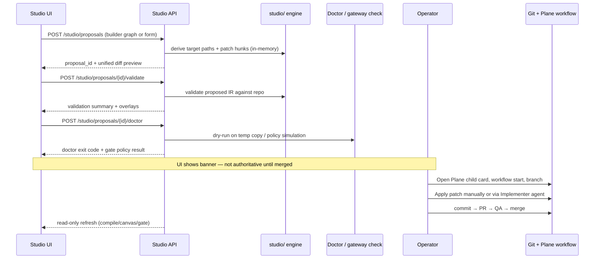

# Studio Service Platform Architecture

> **Status:** Accepted (INVES-77).  
> **Authority:** [`docs/roadmap/sdlc-studio-service-roadmap.md`](../roadmap/sdlc-studio-service-roadmap.md)  
> **ADR:** [ADR-009 — Studio Service as Isolated Control Plane](./decisions.md#adr-009--studio-service-as-isolated-sdlc-control-plane)  
> **Engine:** `studio/` (Foundation — unchanged)

---

## 1. Purpose

Studio Service is a **local SDLC control plane**: a FastAPI backend and React frontend that expose Foundation engine capabilities, repo configuration (`.sdlc/`, `.cursor/`), and live observability without replacing Cursor chat, Plane, or GitHub as authorities.

This document defines **platform boundaries** for phases S1–S6. Implementation is scoped to child cards INVES-78 (backend shell) and INVES-79 (frontend shell).

---

## 2. Package layout vs MarketPulse

Studio Service lives in **separate packages** under `app/` to avoid collision with the MarketPulse product (`app/backend/` + `app/frontend/`).

| Concern | MarketPulse | Studio Service |
|---------|-------------|----------------|
| Backend path | `app/backend/src/marketpulse/` | `app/studio-backend/src/studio_service/` |
| Frontend path | `app/frontend/` | `app/studio-frontend/` |
| Python package | `marketpulse` | `studio_service` |
| npm name | `marketpulse-frontend` | `studio-frontend` |
| Default port (API) | `8000` | `8100` |
| Default port (UI) | `5173` | `5174` |
| URL prefix | `/api/v1/*` | `/studio/*` |
| OpenAPI | `/docs` (root app) | `/studio/docs` or app root `/docs` |
| Persistence | Product SQLite (`investment_radar.db`) | None for MVP shell; extends `sdlc_obs` SQLite for events |
| Shared code | `app/shared/` (JSON schemas, TS types) | Reuses `app/infra/sdlc_obs/`; **does not** import `marketpulse` |
| Engine | N/A | Imports `studio/` at repo root (same as CLI) |

### 2.1 Backend directory tree (target)

```text
app/studio-backend/
├── README.md
├── tests/
│   ├── conftest.py
│   ├── test_health.py
│   └── test_readiness.py
└── src/studio_service/
    ├── main.py                 # FastAPI app, CORS, lifespan
    ├── config.py               # STUDIO_* settings, repo root
    ├── deps.py                 # RepoRoot, EngineService DI
    ├── api/
    │   ├── router.py           # include_router(..., prefix="/studio")
    │   └── routes/
    │       ├── health.py       # S1
    │       ├── readiness.py    # S1
    │       ├── session.py      # S1 — gate + handoff read
    │       ├── engine.py       # S1 — compile, validate, canvas
    │       ├── canvas.py       # S2 — graph detail
    │       ├── obs.py          # S3 — timeline + stream
    │       ├── proposals.py    # S4 — patch preview only
    │       ├── registry.py     # S5
    │       ├── validation.py   # S5
    │       ├── simulation.py   # S5
    │       ├── assistance.py   # S5
    │       ├── evidence.py     # S6
    │       └── integrations/   # S6 — plane.py, github.py
    ├── services/
    │   ├── engine.py           # thin wrapper over studio.*
    │   ├── repo_scanner.py     # read .sdlc/, .cursor/ metadata
    │   ├── session_reader.py   # session-gate.json, handoff.md
    │   ├── mutation.py         # S4 — proposal builder (no apply)
    │   ├── event_bus.py        # S3 — fan-in gateway + obs + handoff
    │   └── doctor_runner.py    # subprocess make sdlc-doctor
    └── schemas/
        ├── canvas.py           # Pydantic mirrors for OpenAPI
        ├── events.py           # StudioEvent envelope
        ├── proposals.py
        └── dashboard.py
```

**Install note (INVES-78):** extend root `pyproject.toml` with optional extra `[studio]` or add `package-dir` mapping for `studio_service`. Dev runner uses `PYTHONPATH=app/studio-backend/src` until packaging is wired.

### 2.2 Frontend directory tree (target)

```text
app/studio-frontend/
├── README.md
├── package.json
├── vite.config.ts              # port 5174; proxy /studio → :8100
├── tailwind.config.js
└── src/
    ├── main.tsx
    ├── App.tsx                 # React Router shell
    ├── api/
    │   └── client.ts           # fetch wrapper, base /studio
    ├── components/
    │   ├── shell/              # TopBar, Sidebar, Layout
    │   ├── dashboard/          # S1 widgets
    │   ├── canvas/             # S2+ React Flow
    │   │   ├── WorkflowCanvas.tsx
    │   │   ├── mapViewModel.ts # API → React Flow nodes/edges
    │   │   └── NodeInspector.tsx
    │   ├── observability/      # S3 timeline
    │   └── common/             # badges: derived vs authoritative
    ├── pages/                  # route targets per screen catalog
    ├── hooks/
    │   ├── useStudioQuery.ts
    │   └── useObsStream.ts     # SSE hook
    └── types/
        └── studio.ts           # hand-maintained or openapi-typescript
```

### 2.3 Coexistence rules

| Rule | Rationale |
|------|-----------|
| No imports from `marketpulse` in `studio_service` | Product vs meta-tool separation |
| No shared FastAPI app instance | Independent deploy/restart |
| `app/shared/` optional for Studio | Prefer OpenAPI-generated TS from Studio API only |
| `studio/` never depends on `app/studio-*` | Engine stays UI-agnostic |
| Single repo root `--root` config | Both services scan same `.sdlc/` tree |

---

## 3. OpenAPI route map (S1–S6)

All routes use prefix **`/studio`**. JSON unless noted. Tags group by delivery phase.

### S1 — Service shell & read-only dashboard

| Method | Path | Tag | Description |
|--------|------|-----|-------------|
| GET | `/studio/health` | s1-shell | Liveness: version, repo root reachable |
| GET | `/studio/readiness` | s1-shell | Wraps `studio.mvp_readiness.check_readiness` |
| GET | `/studio/session/gate` | s1-shell | Read `.sdlc/memory/session-gate.json` |
| GET | `/studio/session/handoff` | s1-shell | Parsed `.sdlc/memory/orchestrator-handoff.md` |
| GET | `/studio/dashboard/summary` | s1-dashboard | Aggregated widgets (readiness, gate, canvas counts) |
| POST | `/studio/engine/compile` | s1-engine | Body: optional `root`; returns compile report |
| POST | `/studio/engine/validate` | s1-engine | Compile + validate; returns validation IR summary |
| GET | `/studio/engine/canvas` | s1-engine | Full `CanvasViewModel` JSON (derived) |

### S2 — Workflow canvas (React Flow)

| Method | Path | Tag | Description |
|--------|------|-----|-------------|
| GET | `/studio/canvas` | s2-canvas | Alias of engine canvas with ETag / cache headers |
| GET | `/studio/canvas/nodes/{display_id}` | s2-canvas | Single node + overlays + source_refs |
| GET | `/studio/workflows` | s2-canvas | List workflow IR summaries from compile |
| GET | `/studio/workflows/{workflow_id}` | s2-canvas | Workflow IR detail + transitions |

Query params (S2): `section`, `validation_status`, `entity_type`, `q` (search).

### S3 — Observability integration

| Method | Path | Tag | Description |
|--------|------|-----|-------------|
| GET | `/studio/obs/runs` | s3-obs | Paginated `sdlc_runs` (wraps obs DB) |
| GET | `/studio/obs/runs/{run_id}` | s3-obs | Single run record |
| GET | `/studio/obs/timeline` | s3-obs | Unified timeline (runs + gateway + handoff + gate) |
| GET | `/studio/obs/events` | s3-obs | **SSE** stream (`text/event-stream`) |
| GET | `/studio/obs/metrics` | s3-obs | KPI summary (from `sdlc_metrics` view) |

Optional later: `WS /studio/obs/ws` — same event envelope as SSE; SSE is default for S3.

Query params: `card`, `run_id`, `since`, `limit`, `event_type[]`.

### S4 — Builders (propose-only mutations)

| Method | Path | Tag | Description |
|--------|------|-----|-------------|
| POST | `/studio/proposals` | s4-proposals | Create patch proposal from builder payload |
| GET | `/studio/proposals/{proposal_id}` | s4-proposals | Proposal + unified diff preview |
| POST | `/studio/proposals/{proposal_id}/validate` | s4-proposals | Engine validate on proposed files (dry-run) |
| POST | `/studio/proposals/{proposal_id}/doctor` | s4-proposals | Doctor dry-run against temp workspace |
| POST | `/studio/proposals/{proposal_id}/gateway-check` | s4-proposals | Policy simulation (no write) |
| DELETE | `/studio/proposals/{proposal_id}` | s4-proposals | Discard in-memory/temp proposal |

**No `POST .../apply` route.** Apply is always external: Plane card → `workflow start` → branch → commit → PR (see §5).

Proposal storage: in-memory or temp dir under `.gitignore`; never committed as authority.

### S5 — Registry & validation UX

| Method | Path | Tag | Description |
|--------|------|-----|-------------|
| GET | `/studio/registry/graph` | s5-registry | Registry entity graph + broken refs |
| GET | `/studio/validation/inspect` | s5-validation | `inspect-validation` projection |
| POST | `/studio/validation/run` | s5-validation | Trigger validate + return full result |
| POST | `/studio/doctor/run` | s5-validation | Subprocess doctor; return exit code + log tail |
| POST | `/studio/simulation/preview` | s5-simulation | Scenario preview (non-executing) |
| POST | `/studio/assistance/workflow` | s5-assistance | Advisory assistance (explicit non-authority) |
| GET | `/studio/skeleton/tests` | s5-qa | Test traceability skeleton list |

### S6 — Delivery integrations

| Method | Path | Tag | Description |
|--------|------|-----|-------------|
| GET | `/studio/integrations/plane/cards/{card}` | s6-integrations | Read-only card detail (MCP/REST proxy) |
| GET | `/studio/integrations/plane/epics/{card}/children` | s6-integrations | Child cards by state |
| GET | `/studio/integrations/github/pulls` | s6-integrations | Open PRs for repo |
| GET | `/studio/integrations/github/checks` | s6-integrations | CI status for branch/ref |
| POST | `/studio/evidence/preview` | s6-evidence | `publish-evidence` projection (clipboard helper) |

### Cross-cutting

| Method | Path | Tag | Description |
|--------|------|-----|-------------|
| GET | `/studio/openapi.json` | meta | OpenAPI 3.1 spec |
| GET | `/studio/config` | meta | Non-secret settings (paths, feature flags) |

**Error envelope** (all phases): `{ "error": { "code", "message", "details" } }` — aligned with ADR-008.

---

## 4. Realtime event schema (SSE / WebSocket)

Studio Observability (S3) unifies three sources into one **`StudioEvent`** envelope. Events are append-only; consumers correlate by `correlation` block.

### 4.1 Envelope (required fields)

```json
{
  "schema_version": "1.0",
  "event_id": "evt_<uuid>",
  "event_type": "obs.run_started",
  "timestamp": "2026-06-03T12:00:00.000Z",
  "source": "sdlc_obs",
  "correlation": {
    "run_id": "run_<uuid>",
    "card": "INVES-78",
    "branch": "feature/INVES-78-studio-backend-shell",
    "session_id": "cursor-session-abc"
  },
  "payload": {}
}
```

### 4.2 Event types

| `event_type` | `source` | When emitted | Key `payload` fields |
|--------------|----------|--------------|----------------------|
| `obs.run_started` | `sdlc_obs` | `pre_task.py` / Collector.start | `task_name`, `stage`, `agent`, `task_tags` |
| `obs.run_ended` | `sdlc_obs` | `post_task.py` / Collector.end | `completion_status`, `duration_ms`, `doctor_exit_code`, `tests_passed`, `tests_failed`, `hallucination_flag` |
| `gateway.shell_allowed` | `sdlc_pre_gateway` | Shell command passes pre-gateway | `command`, `matcher` |
| `gateway.shell_denied` | `sdlc_pre_gateway` | Shell blocked | `command`, `reason`, `policy_ref` |
| `gateway.subagent_start` | `sdlc_pre_gateway` | `subagentStart` hook | `subagent_type`, `expected_agent`, `allowed` |
| `gateway.subagent_stop` | `sdlc_post_gateway` | `subagentStop` hook | `subagent_type`, `stage_complete`, `reroute` |
| `gateway.handoff_blocked` | `sdlc_post_gateway` | Post-gateway blocks advance | `next_agent`, `blockers[]` |
| `gate.write_allowed` | `sdlc_gate_hook` | Write tool allowed | `path`, `tool` |
| `gate.write_denied` | `sdlc_gate_hook` | Write gate deny | `path`, `reason`, `card_required` |
| `handoff.updated` | `handoff_watcher` | `orchestrator-handoff.md` mtime change | `next_agent`, `stage_complete`, `card`, `previous_agent` |
| `session.gate_changed` | `session_watcher` | `session-gate.json` change | `gate_open`, `card`, `branch`, `stage` |

### 4.3 SSE transport

- Endpoint: `GET /studio/obs/events`
- Headers: `Accept: text/event-stream`
- Wire format: `event: studio.obs\ndata: <JSON StudioEvent>\n\n`
- Heartbeat: `: ping\n\n` every 30s
- Initial replay: last N events from ring buffer + SQLite backfill (`since` query param)

### 4.4 Ingestion architecture (S3 implementer)

```text
.cursor/hooks/*.py  ──►  append JSONL  ──►  app/infra/sdlc_obs/data/gateway_events.jsonl
                              │
sdlc_obs hooks      ──►  SQLite sdlc_runs
                              │
handoff/gate        ──►  filesystem watcher (studio_service.event_bus)
                              │
                              ▼
                     EventBus fan-out → SSE subscribers
```

**Schema migration (S3):** add optional `sdlc_events` table or JSONL tail — prefer extending `schema.sql` with `sdlc_events` for indexed timeline queries; gateway JSONL is acceptable for S3 MVP.

### 4.5 Pydantic reference location

Implementer adds `studio_service/schemas/events.py` mirroring this spec; OpenAPI component `StudioEvent`.

---

## 5. Propose-only mutation flow

Visual and form edits **never** write authoritative paths directly. Studio generates previews; humans apply via existing SDLC git/Plane workflow.



### 5.1 Proposal object (API model)

| Field | Type | Notes |
|-------|------|-------|
| `proposal_id` | string | UUID |
| `kind` | enum | `workflow`, `agent`, `rule`, `skill`, `command` |
| `target_paths` | string[] | Under `.sdlc/` or `.cursor/` only |
| `patch_format` | enum | `unified_diff`, `yaml_replace` |
| `patch_body` | string | Display-only until git apply |
| `authority_badge` | string | Always `proposed_non_authoritative` |
| `created_at` | datetime | |
| `expires_at` | datetime | TTL default 24h |

### 5.2 Forbidden API behaviors

- Direct `Write` to `.sdlc/`, `.cursor/`, `AGENTS.md` without proposal flow
- `git commit`, `git push`, `gh pr merge` endpoints
- Plane state transitions without explicit operator confirmation + env credentials
- Persisting canvas/layout as workflow truth

---

## 6. React Flow integration boundaries

React Flow is a **renderer** for derived `CanvasViewModel` output from `studio/canvas_view_model.py`. It is not an IR editor in read-only phases (S1–S2).

### 6.1 Responsibility split

| Layer | Owns | Must not |
|-------|------|----------|
| `studio/canvas_view_model.py` | Semantic nodes, edges, overlays, source_refs, legend | UI coordinates, React component types |
| Studio API | Serialize `CanvasViewModel.to_dict()`, caching, ETag | Store layout positions |
| `mapViewModel.ts` | Map API nodes → React Flow `Node`/`Edge`; assign layout (dagre/elk) | Mutate IR or repo files |
| React Flow components | Pan/zoom, selection, filters, inspector drawer | Call apply/commit endpoints |
| Workflow Builder (S4) | Local draft graph state | Auto-save to `.sdlc/workflows/` |

### 6.2 Node mapping contract

API display node (from Foundation):

```json
{
  "id": "display.node.stage.implementation",
  "graph_node_id": "node.stage.implementation",
  "label": "Implementation",
  "type": "stage",
  "category": "lifecycle",
  "source_refs": [{ "ref_type": "path", "ref": ".sdlc/stages/..." }],
  "validation_overlays": [{ "status": "pass", "messages": [] }]
}
```

React Flow node (frontend-owned):

```json
{
  "id": "display.node.stage.implementation",
  "type": "studioNode",
  "position": { "x": 0, "y": 0 },
  "data": {
    "label": "Implementation",
    "category": "lifecycle",
    "validationStatus": "pass",
    "sourceRefs": ["..."],
    "authority": "derived_non_authoritative"
  }
}
```

- **`position`**: frontend-only; recomputed on layout refresh; optional `localStorage` key `studio.canvas.layout.v1` (explicitly non-authoritative).
- **Custom node types**: `studioNode`, `studioGroup`, `studioOverlay` — implement in S2 (INVES-79+).
- **Edges**: map API `source`/`target` display ids; edge labels from API `label` / `relation`.

### 6.3 Validation overlay UX

- Node border color from worst overlay status: `pass` | `warn` | `fail` | `not_run`
- Legend from API `legend.validation_statuses`
- Inspector drawer shows `source_refs` as file links (`file://` or repo-relative open hint)

### 6.4 Builder mode delta (S4)

- Separate route `/builder` with `mode=edit` local state
- Export calls `POST /studio/proposals` with builder JSON → API translates to Workflow IR patch
- Persistent banner: *"Visual graph is not authoritative until patch is merged via SDLC workflow."*

---

## 7. Dev ergonomics

| Target | Command (INVES-78 adds) | Ports |
|--------|-------------------------|-------|
| MarketPulse | `make -C app start` | 8000 + 5173 |
| Studio Service | `make studio-dev` (root Makefile) | 8100 + 5174 |
| sdlc_obs legacy | `make obs-server` | 7700 (embedded in Studio S3) |

CORS: Studio API allows `http://127.0.0.1:5174` only by default.

---

## 8. Security & enforcement alignment

- Studio Service is **local-first**; bind `127.0.0.1` only until ADR for auth (S7).
- All mutation paths respect `.cursor/hooks` write gate — Studio UI surfaces denials via `gate.write_denied` events, never bypasses hooks.
- Plane/GitHub tokens stay server-side env vars; frontend never receives API keys.
- Chat/agents remain in Cursor; Studio deep-links only.

---

## 9. Phase → card mapping

| Phase | Primary deliverable | Suggested Plane child |
|-------|---------------------|------------------------|
| S1 | Backend + frontend shell, dashboard read-only | INVES-78 BACKEND, INVES-79 FRONTEND |
| S2 | Full canvas viewer | Follow-on frontend/backend |
| S3 | Observability stream | INFRA or BACKEND |
| S4 | Proposal builders | BACKEND + FRONTEND |
| S5 | Registry / validation UX | FRONTEND-heavy |
| S6 | Plane/GitHub panels | BACKEND integrations |
| S7 | Auth, E2E, runbook | INFRA |

---

## 10. References

- [`studio/studio-operating-model.md`](../../studio/studio-operating-model.md)
- [`studio/visual-orchestration-prototype.md`](../../studio/visual-orchestration-prototype.md)
- [`app/infra/sdlc_obs/README.md`](../../app/infra/sdlc_obs/README.md)
- [`.cursor/hooks.json`](../../.cursor/hooks.json)
- [`docs/roadmap/sdlc-enforcement-roadmap.md`](../roadmap/sdlc-enforcement-roadmap.md)
