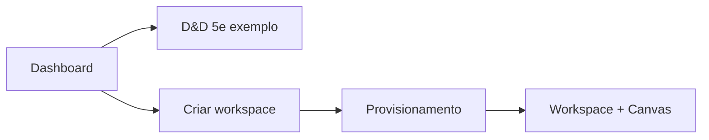

# PoC 1 — Workspace, dashboard e Sheet Canvas

**Status:** ✅ Concluído  
**Objetivo:** primeira experiência usável — dashboard, workspace D&D 5e de exemplo, criação de mesas com provisionamento automático de schema/canvas.

## Contexto de produto

Cada **workspace** = uma **mesa de RPG**. Ao criar:

1. Nome, mestre e ficha (arquivo, JSON ou texto)
2. Provisionamento de `sheet_schema`, `canvas_spec` e dados iniciais
3. Dashboard com exemplo D&D 5e funcional

## Fluxo entregue

## Marcos entregues

| # | Marco | Entregável |
|---|-------|------------|
| P1.1 | Organização `apps/` | `apps/backend/`, `apps/frontend/` — ver [organizacao-apps.md](organizacao-apps.md) |
| P1.2 | Modelo `workspaces` | SQLite dev; modelos ORM + Pydantic |
| P1.3 | Dashboard | Home com lista + card D&D 5e |
| P1.4 | Formulário criação | Nome, mestre, ficha (file/json/text) |
| P1.5 | Seed D&D 5e | Fixture + workspace exemplo |
| P1.6 | Provisionamento | `POST /v1/workspaces` |
| P1.7 | BFF mínimo | `/v1/workspaces/*`, example-sheet |
| P1.8 | SheetCanvas | `field_grid`, `stat_row`, `rich_text` |
| P1.9 | WorkspacePage | Detalhe da mesa + canvas |

## Entrada da ficha

| Modo | PoC 1 | PoC 2+ |
|------|-------|--------|
| Arquivo | Armazena; fixture/stub | DPA Agent analisa |
| JSON | Valida contra schema | Publish directo |
| Texto | Stub determinístico | DPA Agent analisa |

## Critério de saída

✅ Dashboard com D&D 5e; criar workspace; ver ficha no canvas; runtime em `apps/`.

## Código

| Área | Path |
|------|------|
| API | `apps/backend/app/routers/workspaces.py` |
| UI | `apps/frontend/src/pages/HomePage.tsx`, `WorkspacePage.tsx` |
| Canvas | `apps/frontend/src/components/SheetCanvas.tsx` |
| Testes | `tests/test_provisioning.py` |

## Links

- [product/sheet-canvas.md](../product/sheet-canvas.md)
- [organizacao-apps.md](organizacao-apps.md)
