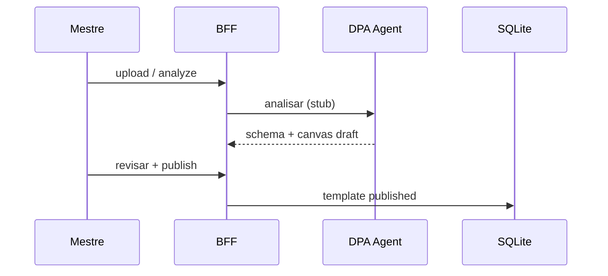

# PoC 2 — DPA Agent e publicação de template

**Status:** ✅ Concluído (stub LLM — LLM real → Fase 1)  
**Objetivo:** transformar ficha do mestre em template revisável via **DPA Agent**, com HITL antes da publicação.

## Contexto

O **DPA Agent** (evolução do `sheet-template-analyst`) constrói por modelo de RPG:

- `sheet_schema` — campos tipados
- `canvas_spec` — layout visual
- Persistência derivada
- Artefatos em `generated/`

No PoC, a análise usa **stub determinístico**; a integração LLM multimodal é Fase 1.3.

## Fluxo entregue

## Marcos entregues

| # | Marco | Status |
|---|-------|--------|
| P2.1 | DPA Agent / analyzer | ✅ `apps/backend/app/services/dpa_analyzer.py` |
| P2.2 | Upload de ficha | ✅ template/source |
| P2.3 | Análise passo a passo | ✅ steps + warnings |
| P2.4 | Draft persistido | ✅ analysis/schema/canvas JSON |
| P2.5 | UI de revisão | ✅ WorkspacePage upload/analyze |
| P2.6 | Correções manuais | ✅ preview antes publish |
| P2.7 | Publish HITL | ✅ `POST template/publish` |
| P2.8 | Provisionamento | ✅ template versionado |
| P2.9 | Evals smoke | ❌ → Fase 1 (RPG-64) |

## Critério de saída

✅ Mestre envia ficha, revisa draft, publica e usa no fluxo PoC 1.

## Código

| Área | Path |
|------|------|
| Router | `apps/backend/app/routers/template.py` |
| Analyzer | `apps/backend/app/services/dpa_analyzer.py` |
| Publish | `apps/backend/app/services/template_publish.py` |
| Testes | `tests/test_dpa_analyzer.py` |

## Links

- [product/sheet-canvas.md](../product/sheet-canvas.md)
- [sdlc/ai-native.md](../sdlc/ai-native.md)
- `.sdlc/agents/subagents/sheet-template-analyst.yaml`
