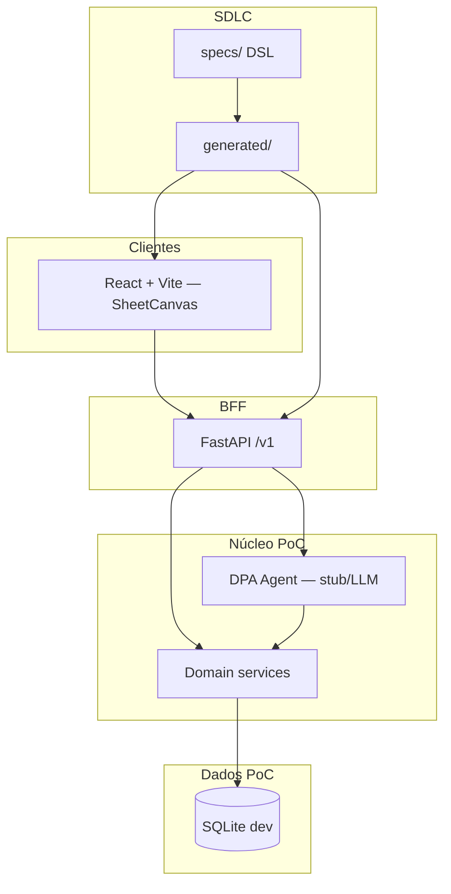

# Arquitetura de produto

Foco: **template de ficha a partir do exemplo do mestre** + **Sheet Canvas**. Detalhes de canvas em [sheet-canvas.md](sheet-canvas.md).

> **Estado:** PoC concluído em localhost (`apps/backend` + `apps/frontend`).

## Visão em camadas

## Runtime actual (PoC)

| Camada | Tecnologia | Path |
|--------|------------|------|
| Frontend | React 18 + Vite | `apps/frontend/` |
| BFF | FastAPI | `apps/backend/app/` |
| Persistência dev | SQLite | `apps/backend/data/` |
| DPA | Stub determinístico | `app/services/dpa_analyzer.py` |
| Contratos | DSL Python | `specs/` → `generated/` |

## Conceitos de domínio

| PoC (entregue) | Fase 2+ (roadmap) |
|----------------|-------------------|
| `workspaces` | + convites, membros reais |
| `sheet_templates` draft/published | + object storage S3 |
| `characters`, `sheets`, `sheet_revisions` | + PostgreSQL |
| SessionBar mock (GM/jogador) | Auth JWT / OAuth |

## API BFF (resumo)

Prefixo `/v1`. Implementação: `apps/backend/app/routers/`.

| Área | Rotas principais |
|------|------------------|
| Workspaces | `GET/POST /workspaces`, example-sheet |
| Template | upload, analyze, publish, extend, remove-field |
| Characters | CRUD por workspace |
| Sheets | get/patch + revisões |

Contrato declarativo: `specs/api/bff_v1.py` (revisão Fase 1.2).

## Fronteiras

- **Agente propõe, GM publica** — nunca auto-publish de template
- **Specs são fonte de verdade** — OpenAPI/TS derivados por compile
- **Canvas no frontend** — backend entrega payload agregado (schema + spec + data)

## Links

- [sheet-canvas.md](sheet-canvas.md)
- [../infrastructure/project-architecture.md](../infrastructure/project-architecture.md)
- [../poc/00-indice-poc.md](../poc/00-indice-poc.md)
