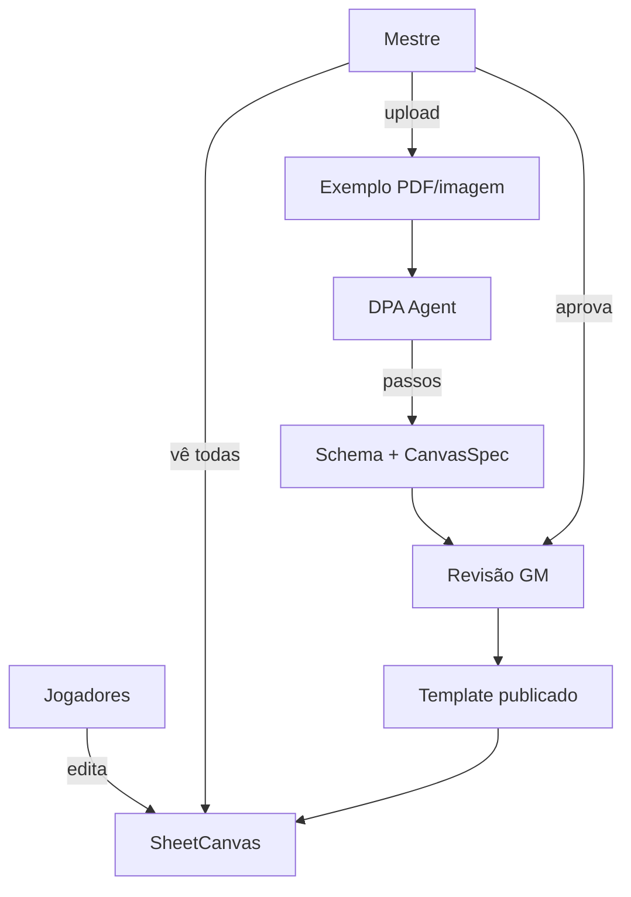

# Sheet Canvas — ficha visual a partir do exemplo do mestre

Foco do produto: apresentar fichas para jogadores e mestre com layout fiel ao que a mesa já usa. O mestre envia uma **ficha exemplo**; o **DPA Agent** analisa passo a passo, constrói schema + canvas; jogadores preenchem nesse layout.

> **PoC:** fluxo completo validado em localhost — ver [poc/00-indice-poc.md](../poc/00-indice-poc.md).

## Fluxo principal

## Atores e permissões

| Ator | Pode |
|------|------|
| **Mestre** | Upload, revisar, publicar, ver todas as fichas, estender template |
| **Jogador** | Ver e editar **a própria** ficha (campos permitidos) |
| **DPA Agent** | Analisar e propor — **não publica** sem GM |

`role_overrides` no `canvas_spec` controla readonly por papel.

## Artefatos

### Ficha exemplo (`template_source`)

PDF, PNG ou JPG armazenado por workspace.

### Análise (`template_analysis`)

Passos auditáveis em `analysis.steps[]` — visíveis na UI de revisão.

### Schema (`sheet_schema`)

Campos tipados, seções, validação — compilado de `specs/templates/`.

### Canvas spec (`canvas_spec`)

Layout visual: regiões, ordem, `presentation` (`field_grid`, `stat_row`, `rich_text`), `role_overrides`.

### Instância (`sheet`)

Dados do personagem validados contra `template_version` + `data_json`.

## DPA Agent

| Modo | Uso |
|------|-----|
| **analyze** | Ficha nova → schema + canvas draft |
| **extend** | Novos campos/seções sem reupload (PoC 4) |

PoC 2 usa **stub determinístico**; LLM multimodal → Fase 1.3.

## UI (PoC entregue)

| Tela | Componente |
|------|------------|
| Dashboard | `HomePage` — workspaces + D&D 5e exemplo |
| Workspace | `WorkspacePage` — upload, publish, extend, dashboard GM |
| Canvas | `SheetCanvas` — render + edição inline |
| Papéis | `SessionBar` — alternar GM / jogador (mock dev) |

## API BFF (implementado)

Prefixo `/v1/workspaces/{id}/…` — ver routers em `apps/backend/app/routers/`.

| Método | Rota | Uso |
|--------|------|-----|
| POST | `template/analyze` | Dispara DPA |
| GET/PATCH | `template/analysis` | Draft + correções GM |
| POST | `template/publish` | HITL publish |
| POST | `template/extend` | Novos campos |
| GET/PATCH | `sheets/{id}` | Dados + validação |

## Extensibilidade

1. GM pede novo campo/seção
2. DPA modo **extend** propõe patch append-only
3. GM aprova → nova `template_version`
4. Fichas existentes recebem defaults

Remoção de campo com dados exige confirmação explícita (PoC 4).

## SDLC / DSL

- `specs/templates/dnd5e_sheet.py`, `dnd5e_canvas.py`
- `specs/templates/analysis_result.py`
- `specs/agents/sheet_template_analyst.py`

`rpg compile` → Pydantic, TS, OpenAPI em `generated/`.

## Fora do escopo (Fase 1)

- Subagentes de combate, leveling, Q&A de regras
- Presets D&D/Tormenta como catálogo global
- OCR em massa

## Critérios de sucesso (PoC ✅)

1. GM envia ficha exemplo da mesa
2. DPA produz passos + schema + canvas
3. GM publica e vê preview fiel
4. Jogador preenche no canvas; GM vê todas
5. GM estende template sem reupload

## Links

- [arquitetura-produto.md](arquitetura-produto.md)
- [../05-roadmap.md](../05-roadmap.md)
- [../sdlc/ai-native.md](../sdlc/ai-native.md)
