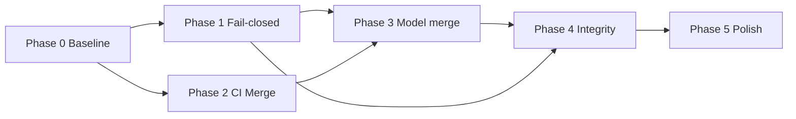

# SDLC AI-Native — Enforcement & Structure Roadmap

> **Purpose:** Phased delivery order for hardening the SDLC operating system.  
> **Planning detail:** [`sdlc-enforcement-planning.md`](sdlc-enforcement-planning.md).  
> **Use when:** After the in-flight agent execution lands; implement on `sdlc/` branches per Plane cards.

---

## Overview

```text
Phase 0 ─ Baseline & epic     (1 session)
Phase 1 ─ P0 fail-closed      (blocking safety)
Phase 2 ─ P0 CI + merge truth (blocking quality)
Phase 3 ─ P1 model merge      (remove duplication)
Phase 4 ─ P1 integrity        (handoff + evidence + intent)
Phase 5 ─ P2 polish           (docs sync, metrics, optional generator)
```

**North star:** Smallest structure that enforces the full pipeline without human clicks and without duplicate stage definitions.

---

## Phase 0 — Baseline & Tracking

| ID | Deliverable | Exit criteria |
|----|-------------|---------------|
| 0.1 | Plane epic `[AI][EPIC] SDLC deterministic enforcement` | Epic + ≥3 children (INFRA/SDLC/SDLC) |
| 0.2 | Snapshot audit | `make sdlc-doctor` exit 0; `make sdlc-validate` recorded (pass/fail logged on epic) |
| 0.3 | Freeze conflicting refactors | No parallel edits to `hooks.json`, `gate.py`, `workflow.py` on other branches |

**Child card suggestions:**

| Child | Scope |
|-------|--------|
| `[AI][INFRA] CI pytest validate lint` | Phase 2 |
| `[AI][SDLC] Fail-closed hooks and break-glass` | Phase 1 |
| `[AI][SDLC] Lifecycle model merge and roster` | Phase 3–4 |

---

## Phase 1 — P0 Fail-Closed (Week 1)

**Goal:** Hooks and CLI cannot silently allow bypass.

| Priority | Item | Files / commands | Done when |
|----------|------|------------------|-----------|
| P0.1 | `failClosed: true` on gate + gateway hooks | `.cursor/hooks.json` | Blocked write test passes |
| P0.2 | Deny on policy/gate load failure | `sdlc_gateway_lib.py`, `sdlc_gate_hook.py` | Simulated missing yaml → deny |
| P0.3 | Break-glass for `--force` / `--skip-*` | `workflow.py`, `auto_merge_pr.py` | Only with `SDLC_BREAK_GLASS` + Plane note |
| P0.4 | Epic start fail-closed | `workflow.py` `cmd_start` | Plane API down → exit 1, gate stays closed |
| P0.5 | Gateway tests in CI | `.cursor/hooks/test_sdlc_gateway.py` | Job green on PR |

**Risks:** Agents blocked mid-session → document `workflow start` recovery in handoff template.

**Do not:** Weaken deny rules to “fix” agent friction without SDLC_META card.

---

## Phase 2 — P0 CI & Merge Truth (Week 1–2)

**Goal:** Green CI means tests + schema + structure; merge means reviewed code.

| Priority | Item | Files | Done when |
|----------|------|-------|-----------|
| P0.6 | CI: `pytest` SDLC + hooks | `.github/workflows/ci.yml` | Required check on PR |
| P0.7 | CI: `make sdlc-validate` | `ci.yml`, `Makefile` | Required check on PR |
| P0.8 | CI: lint (ruff) scoped | `ci.yml`, `pyproject.toml` if needed | Required or advisory per team |
| P0.9 | Merge: required checks @ PR head | `auto_merge_pr.py` | Refuses stale green run |
| P0.10 | Merge: review APPROVE gate | `auto_merge_pr.py` | No merge without approval record |

**Exit criteria Phase 2:** A deliberate red pytest fails PR; merge script exits 1 without APPROVE.

---

## Phase 3 — P1 Lifecycle Model Merge (Week 2–3)

**Goal:** One canonical stage graph; Doctor fails on drift.

| Priority | Item | Outcome |
|----------|------|---------|
| P1.1 | Create `.sdlc/process/lifecycle-model.yaml` | stages + transitions + write_policy |
| P1.2 | Loader reads model | `loader.py`, `gate.py`, `workflow.py` |
| P1.3 | Shim period | `paths.yaml` / `transitions.yaml` re-export or Doctor warns DEPRECATED |
| P1.4 | Slim `master-workflow.md` | Operational map table only; link to model |
| P1.5 | Align gate stage keys | `planning` ↔ `ticket`/`requirements` aliases in model |
| P1.6 | `sdlc-validate` extends | Stage in transitions exists; write_policy stages ⊆ lifecycle ids |
| P1.7 | Doctor: single-stage-source check | FAIL if duplicate stage lists diverge |

**Exit criteria Phase 3:** Delete or auto-generate old YAML shards; `sdlc-validate` green; mapping table in master-workflow matches model.

---

## Phase 4 — P1 Integrity (Week 3–4)

**Goal:** Handoff and evidence reflect reality; one intent path; one agent roster.

| Priority | Item | Outcome |
|----------|------|---------|
| P1.8 | `catalog.yaml` canonical roster | pipeline.yaml generated or removed |
| P1.9 | `policy.valid_agents` synced | Doctor cross-check |
| P1.10 | Post-gateway evidence script | Plane state + branch + test exit cross-check |
| P1.11 | Ephemeral evidence path | `.sdlc/memory/.evidence-*.json` gitignored; template stays example-only |
| P1.12 | Transition checks on `workflow start` | Illegal jump blocked |
| P1.13 | Unify intent classification | Single `intent_rules.yaml` or agent-only path |

**Exit criteria Phase 4:** No committed `evidence-INVES-*.json` in repo; handoff cannot mark `yes` with failing QA script.

---

## Phase 5 — P2 Polish (Backlog)

| ID | Item | Notes |
|----|------|-------|
| P2.1 | `make sdlc-sync-model` | Optional codegen for backward compat one release |
| P2.2 | Obs compliance metrics | Plane timeline + obs DB (per master-workflow P2) |
| P2.3 | Contract validator in FEATURE pipeline | When product API exists |
| P2.4 | Security scanner mandatory on INFRA cards | Optional gate on PR label |
| P2.5 | README index pass | Each `.sdlc/<module>/README.md` points to lifecycle-model section |

---

## Priority Matrix (Quick Reference)

| Prio | Theme | User-visible effect |
|------|-------|---------------------|
| **P0** | Fail-closed + CI + merge | Cannot merge broken/unreviewed SDLC changes |
| **P1** | Model merge + integrity | No stage confusion; trustworthy handoff |
| **P2** | Tooling polish | Easier maintenance, metrics |

---

## Milestones

| Milestone | Target | Criteria |
|-----------|--------|----------|
| **M1 — Safe by default** | After Phase 1–2 | Hooks deny; CI runs tests+validate; merge checks review |
| **M2 — Single model** | After Phase 3 | `lifecycle-model.yaml` authoritative; Doctor drift checks |
| **M3 — Trustworthy pipeline** | After Phase 4 | One roster; evidence ephemeral; transitions enforced |
| **M4 — SaaS-ready ops** | After Phase 5 | Metrics + optional sync; product greenfield unblocked |

Dates: **2026-06-04** — M1–M4 shipped (INVES-93–98): fail-closed, CI, lifecycle-model, integrity, ruff, compliance metrics, README index pass.

---

## Dependency Graph



Phase 1 and 2 can run in parallel after Phase 0. Phase 3 should not start until P0 hooks/CI are stable (avoid debugging model merge while enforcement is fail-open).

---

## What We Explicitly Defer

- Product `app/backend` / `app/frontend` implementation (separate GREENFIELD epic).
- Full BPM / visual workflow designer (see [`sdlc-studio-service-roadmap.md`](sdlc-studio-service-roadmap.md) — Studio Service, not enforcement epic).
- Replacing Plane with local state.
- Auto-running Orchestrator without human session (daemon) — out of scope.

---

## Alignment With Existing `roadmap.md`

| File | Scope |
|------|--------|
| [`roadmap.md`](roadmap.md) | Product phases (backend, frontend, infra deploy) |
| **This file** | SDLC OS hardening (enforcement, structure, CI) |
| [`sdlc-studio-mvp-roadmap.md`](sdlc-studio-mvp-roadmap.md) | Studio Foundation (engine; historical “MVP” name) |
| [`sdlc-studio-service-roadmap.md`](sdlc-studio-service-roadmap.md) | Studio Service (UI, API, observability) |

Do not merge product and SDLC enforcement roadmaps into one file — cross-link only.

---

## Checklist for Implementer (Per Phase)

Copy to Plane child card description as needed.

**Phase 1**

- [ ] Update `hooks.json` failClosed
- [ ] Patch gateway/gate fail-closed load
- [ ] Break-glass env documented
- [ ] Run hook tests locally
- [ ] `make sdlc-doctor`

**Phase 2**

- [ ] Extend `ci.yml`
- [ ] Patch `auto_merge_pr.py`
- [ ] Dry-run merge on test PR

**Phase 3**

- [ ] Add `lifecycle-model.yaml`
- [ ] Refactor loaders
- [ ] Update master-workflow map
- [ ] `make sdlc-validate`

**Phase 4**

- [ ] Catalog roster sync
- [ ] Evidence gitignore + script paths
- [ ] Post-gateway verifier
- [ ] Intent unification

---

*Last updated: 2026-06-03 — paired with enforcement planning doc and repository audit.*
