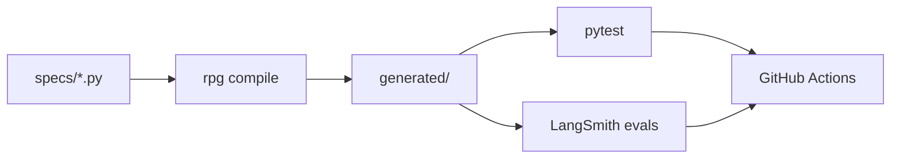

# SDLC AI-native e DSL Python

Este documento define como o **desenvolvimento do RPG-OP** segue um ciclo orientado a agentes, com **DSL Python** em `specs/` como fonte de verdade.

> **Estado:** PoC L1 entregue; meta **L2** na Fase 1 (evals smoke).

## Por que SDLC AI-native?

| Tradicional | AI-native (RPG-OP) |
|-------------|---------------------|
| PRD + código diverge | **Spec em Python** versionada no git |
| Prompts espalhados | **Skills/subagentes** da DSL |
| Testes só de API | **Evals de agente** como gate CI |
| Schema duplicado BE/FE | **Compilador DSL** → Pydantic, OpenAPI, TS |

## Ciclo



## Estrutura no monorepo

```text
rpg-op/
├── .sdlc/              # Harness SDLC (agentes, scripts .sh)
├── .cursor/            # IDE: rules, hooks, MCP
├── apps/
│   ├── backend/        # FastAPI BFF
│   └── frontend/       # React + Vite
├── docs/
│   ├── product/        # Visão, canvas, arquitetura produto
│   ├── poc/            # Proof of Concept entregue
│   ├── sdlc/           # Este documento
│   ├── status/         # Pendências
│   └── infrastructure/
├── specs/              # Fonte de verdade DSL
├── generated/          # Saída de compile — não editar
├── packages/rpg_dsl/
└── tests/
```

## Compilador — targets

| Target | Saída | Consumidor |
|--------|-------|------------|
| `pydantic` | `generated/pydantic/` | Backend |
| `openapi` | `generated/openapi/` | BFF, clientes |
| `typescript` | `generated/typescript/` | Frontend |
| `agent_manifest` | `generated/agent_manifest/` | Deep Agent |
| `evals` | `generated/evals/` | LangSmith CI (Fase 1) |

Comandos: `rpg validate specs/` · `rpg compile --target all`

## Dev harness

| Subagente | Função |
|-----------|--------|
| `spec-author` | Edita `specs/` |
| `codegen-integrator` | compile + integração |
| `eval-engineer` | `specs/evals/` |
| `sdlc-doctor` | Saúde SDLC, drift, gates |

Skills: `.sdlc/skills/` · Commands: `.sdlc/commands/`

## Fases SDLC ↔ GitHub

| Fase | Atividade | Gate |
|------|-----------|------|
| Intent | Issue SDLC | `sdlc:intent` |
| Spec | DSL em `specs/` | `sdlc:spec` |
| Compile | `rpg compile` | commit |
| Implement | código + hooks | `make validate` |
| Eval | LangSmith | `sdlc:eval` (Fase 1) |
| Review | PR | workflow SDLC verde |

## Maturidade

| Nível | Critério | Estado |
|-------|----------|--------|
| L0 | Specs scaffold | ✅ |
| L1 | compile + manifest + PoC | ✅ **actual** |
| L2 | evals smoke CI | Fase 1.1 |
| L3 | dev harness runtime | backlog |
| L4 | migrações geradas | backlog |

## Regras de PR

- Comportamento de ficha/agente **exige** diff em `specs/`.
- PR com `specs/evals/` **exige** eval smoke verde.
- Commitar `generated/` para diffs de contrato legíveis.

## Links

- [product/sheet-canvas.md](../product/sheet-canvas.md)
- [../05-roadmap.md](../05-roadmap.md) — Fase 1 Hardening
- [.sdlc/README.md](../../.sdlc/README.md)
- [.cursor/README.md](../../.cursor/README.md)
